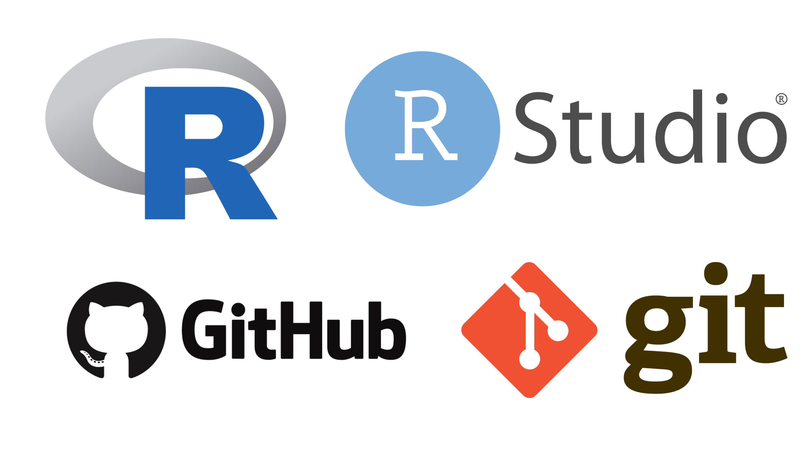

```{r}
#| eval: true 
#| echo: false
#| fig-align: "center"
#| out-width: "60%" 
#| fig-alt: "Logos for R Project, RStudio, GitHub, and git"

```

## Prerequisites

::: {.callout-note}
## No prior Shiny experience is necessary for participating in this course! However,

we do assume general familiarity with the R programming language. We also ask that you arrive with all necessary software installed / configured. See the [MEDS Installation Guide](https://ucsb-meds.github.io/MEDS-installation-guide/){target="_blank"} (steps 1 - 7) for detailed instructions.
:::

[**Before class, you should have:**]{.teal-text}

1. [R](https://cloud.r-project.org/) & [RStudio](https://posit.co/products/open-source/rstudio/) installed  
2. A [GitHub](https://github.com/) profile & [git](https://git-scm.com/) installed / configured
3. The following R packages installed. Install / update them all at once by running the following in your console:
 
```{r}
#| eval: false
#| echo: true
#| code-line-numbers: false
install.packages(pkgs = c("here", "tidyverse", "shiny", "shinydashboard", "shinyWidgets", "shinycssloaders", "markdown", "DT", "leaflet", "bslib", "fresh", "sass", "reactlog", "shinytest2", "diffviewer", "palmerpenguins", "lterdatasampler", "gapminder"))
```

<!-- 4. **(Optional, but recommended)** Install the [Let's get color blind](https://chromewebstore.google.com/detail/lets-get-color-blind/bkdgdianpkfahpkmphgehigalpighjck){target="_blank"} Google Chrome extension -->

<!-- ::: {.center-text .body-text-m .teal-text} -->
<!-- **Please see the [MEDS Installation Guide](https://ucsb-meds.github.io/MEDS-installation-guide/){target="_blank"} for more detailed instructions on installing the above software.** -->
<!-- ::: -->

## Reference code

We'll be building / playing with a number of small apps and dashboards throughout this workshop. The lecture slides include all necessary code. 

<!-- but you may also reference the complete source code for each app on [GitHub](https://github.com/samanthacsik/EDS-296-shiny-apps){target="_blank"}.  -->

We'll be creating our own GitHub repositories to house our apps, so *you do not need to fork this repo*.
