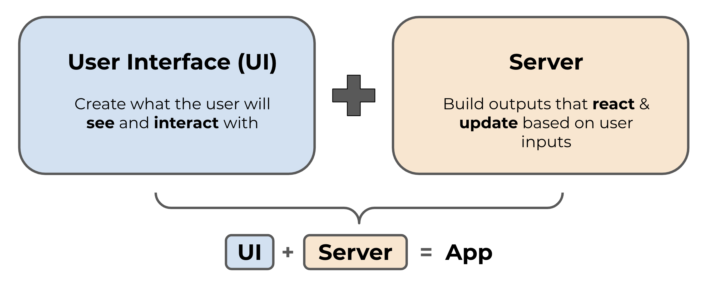

```{r}
#| eval: true 
#| echo: false
#| fig-align: "center"
#| out-width: "80%" 
#| fig-alt: "A simple schematic of a Shiny app, which includes the User Interface (UI, colored in blue) and the Server (colored in orange). The UI creates what the user will see and interact with, while the server builds the outputs that react and update based on user inputs."

```

::: {.center-text .body-text-s .gray-text}
A *very* basic illustration of a Shiny app
:::

##  Required Packages {#pkgs}

We'll be loading the following R packages: 

```{r}
#| eval: false
#| echo: true
#| code-line-numbers: false
library(shiny)
```

##  Required Data {#data}

*No data downloads required for this section*

##  Lecture Materials {#lecture-materials}

<!-- Part 1 is broken down into two lessons: -->

|  Lecture slides   | 
|------------------------------------------------------------------------------------------|
| [Lecture 1.1: What is Shiny?](slides/part1.1-shiny-overview-slides.qmd){target="_blank"}  | 
| [Lecture 1.2: Setting up your app](slides/part1.2-setup-app-slides.qmd){target="_blank"}  | 
: {.hover .bordered tbl-colwidths="[50,25,25]"}

<!-- ::: {.grid} -->

<!-- ::: {.g-col-12 .g-col-md-6} -->
<!-- ::: {.center-text} -->
<!-- [**What is Shiny?**]{.teal-text .body-text-m} -->

<!-- [ lecture 1.1 slides](slides/part1.1-shiny-overview-slides.qmd){.btn role="button" target="_blank"}  -->
<!-- ::: -->
<!-- ::: -->

<!-- ::: {.g-col-12 .g-col-md-6} -->
<!-- ::: {.center-text} -->
<!-- [**Setting up your app**]{.teal-text .body-text-m} -->

<!-- [ lecture 1.2 slides](slides/part1.2-setup-app-slides.qmd){.btn role="button" target="_blank"}  -->
<!-- ::: -->
<!-- ::: -->

<!-- ::: -->

