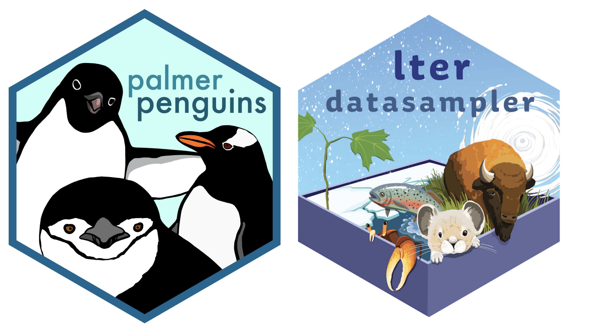

```{r}
#| eval: true 
#| echo: false
#| fig-align: "center"
#| out-width: "60%" 
#| fig-alt: ""

```

::: {.center-text .body-text-s .gray-text}
Artwork by [Allison Horst](https://allisonhorst.com/)
:::

##  Required Packages {#pkgs}

We'll be using the following R packages: 

```{r}
#| eval: false
#| echo: true
#| code-line-numbers: false
library(shiny)
library(tidyverse)
library(DT)
library(shinyWidgets)
library(shinycssloaders)
library(markdown)
library(rsconnect)
```

##  Required Data {#data}

```{r}
#| eval: false
#| echo: true
#| code-line-numbers: false
library(palmerpenguins)
library(lterdatasampler)
```

##  Lecture Materials {#lecture-materials}

Part 2 is broken down into three lessons:

<!-- UPDATE GGPLOT THEME TO FUNCTION  -->

|  Lecture slides   | 
|------------------------------------------------------------------------------------------|
| [Lecture 2.1: Building a single-file app](slides/part2.1-single-file-app-slides.qmd){target="_blank"}  | 
| [Lecture 2.2: Building a two-file app](slides/part2.2-two-file-app-slides.qmd){target="_blank"}  |
| [Lecture 2.3: Deploying apps + improving UX](slides/part2.3-deploy-improve-ux-slides.qmd){target="_blank"}  |
: {.hover .bordered tbl-colwidths="[50,25,25]"}

<!-- ::: {.grid} -->

<!-- ::: {.g-col-12 .g-col-md-4} -->
<!-- ::: {.center-text} -->
<!-- [**Single-file app**]{.teal-text .body-text-m} -->

<!-- [ lecture 2.1 slides](slides/part2.1-single-file-app-slides.qmd){.btn role="button" target="_blank"}  -->
<!-- ::: -->
<!-- ::: -->

<!-- ::: {.g-col-12 .g-col-md-4} -->
<!-- ::: {.center-text} -->
<!-- [**Two-file app**]{.teal-text .body-text-m} -->

<!-- [ lecture 2.2 slides](slides/part2.2-two-file-app-slides.qmd){.btn role="button" target="_blank"}  -->
<!-- ::: -->
<!-- ::: -->

<!-- ::: {.g-col-12 .g-col-md-4} -->
<!-- ::: {.center-text} -->
<!-- [**Deploying & Improving UX**]{.teal-text .body-text-m} -->

<!-- [ lecture 2.3 slides](slides/part2.3-deploy-improve-ux-slides.qmd){.btn role="button" target="_blank"}  -->
<!-- ::: -->
<!-- ::: -->

<!-- ::: -->
