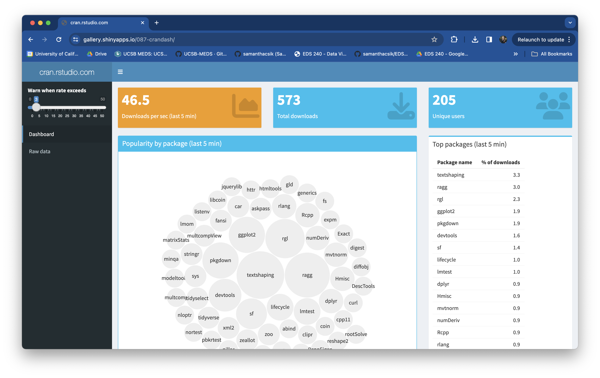

```{r}
#| eval: true 
#| echo: false
#| fig-align: "center"
#| out-width: "60%" 

```

::: {.center-text .body-text-s .gray-text}
An example shinydashboard which displays streaming data from the RStudio CRAN mirror logs. Explore the [dashboard](https://gallery.shinyapps.io/087-crandash/) and [source code](https://github.com/rstudio/shiny-examples/tree/main/087-crandash).
:::

##  Required Packages {#pkgs}

We'll be using the following R packages: 

```{r}
#| eval: false
#| echo: true
#| code-line-numbers: false
library(shiny)
library(shinydashboard)
library(tidyverse)
library(shinycssloaders)
library(leaflet)
library(markdown)
```

##  Required Data {#data}

We'll be using publicly-available data via the [Arctic Data Center](https://arcticdata.io/catalog) for our shiny dashboard.

::: {.callout-note icon=false}
## Data citation
Christopher Arp, Matthew Whitman, Katie Drew, and Allen Bondurant. 2022. Water depth, surface elevation, and water temperature of lakes in the Fish Creek Watershed in northern Alaska, USA, 2011-2022. Arctic Data Center. [doi:10.18739/A2JH3D41P](https://arcticdata.io/catalog/view/doi%3A10.18739%2FA2JH3D41P).
:::

Take a few moments to review the [metadata record](https://arcticdata.io/catalog/view/doi%3A10.18739%2FA2JH3D41P) and download [FCWO_lakemonitoringdata_2011_2022_daily.csv](https://arcticdata.io/metacat/d1/mn/v2/object/urn%3Auuid%3A73800a2e-7617-470a-83aa-b530a01f32e3).

##  Lecture Materials {#lecture-materials}

<!-- Part 3 is contained in one lesson: -->

|  Lecture slides   | 
|------------------------------------------------------------------------------------------|
| [Lecture 3: Building Shiny dashboards](slides/part3-shiny-dashboard-slides.qmd){target="_blank"}  | 
: {.hover .bordered tbl-colwidths="[50,25,25]"}

<!-- ::: {.center-text} -->
<!-- [**Shiny dashboard**]{.teal-text .body-text-m} -->

<!-- [ lecture 3 slides](slides/part3-shiny-dashboard-slides.qmd){.btn role="button" target="_blank"}  -->
<!-- ::: -->

