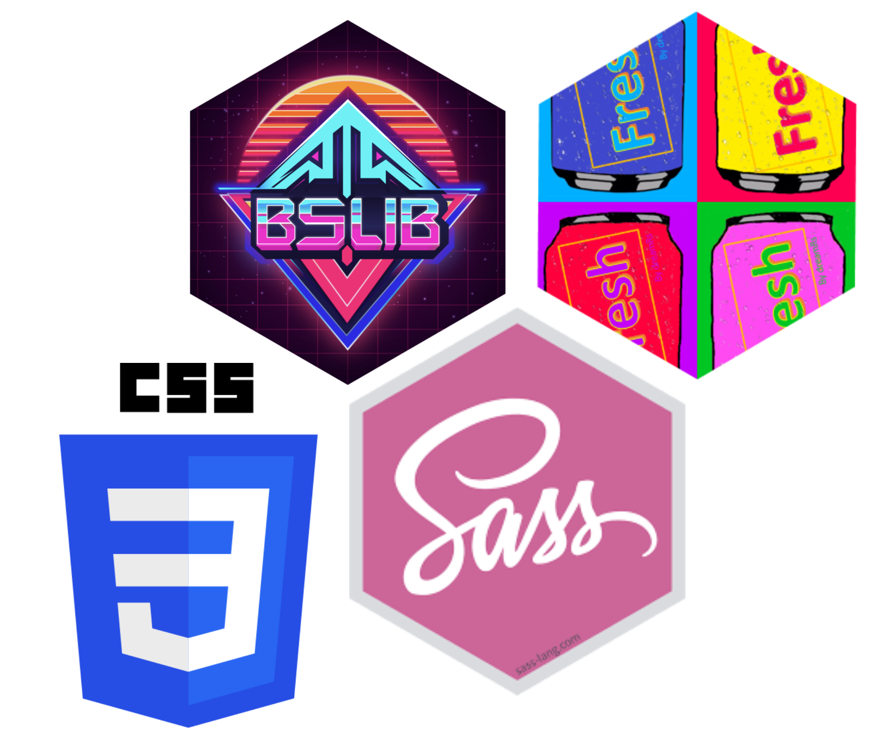

```{r}
#| eval: true 
#| echo: false
#| fig-align: "center"
#| out-width: "50%" 
#| fig-alt: "{fresh} and {sass} R package hexes, the logo for CSS 3, and text that reads '{bslib}`"

```

##  Required Packages {#pkgs}

We'll be using the following R packages: 

```{r}
#| eval: false
#| echo: true
#| code-line-numbers: false
library(shiny)
library(shinydashboard)
library(tidyverse)
library(bslib)
library(fresh)
library(sass)
```

##  Required Data {#data}

```{r}
#| eval: false
#| echo: true
#| code-line-numbers: false
library(palmerpenguins)
library(lterdatasampler)
```

##  Lecture Materials {#lecture-materials}

<!-- Part 4 is broken down into two lessons: -->

|  Lecture slides   | 
|------------------------------------------------------------------------------------------|
| [Lecture 4.1: `{bslib}` & `{fresh}`](slides/part4.1-bslib-fresh-slides.qmd){target="_blank"}  | 
| [Lecture 4.2: Styling with CSS & Sass](slides/part4.2-css-sass-slides.qmd){target="_blank"} |
: {.hover .bordered tbl-colwidths="[50,25,25]"}

<!-- ::: {.grid} -->

<!-- ::: {.g-col-12 .g-col-md-6} -->
<!-- ::: {.center-text} -->
<!-- [**`{bslib}` & `{fresh}`**]{.teal-text .body-text-m} -->

<!-- [ lecture 4.1 slides](slides/part4.1-bslib-fresh-slides.qmd){.btn role="button" target="_blank"}  -->
<!-- ::: -->
<!-- ::: -->


<!-- ::: {.g-col-12 .g-col-md-6} -->
<!-- ::: {.center-text} -->
<!-- [**Styling with CSS & Sass**]{.teal-text .body-text-m} -->

<!-- [ lecture 4.2 slides](slides/part4.2-css-sass-slides.qmd){.btn role="button" target="_blank"}  -->
<!-- ::: -->
<!-- ::: -->

<!-- ::: -->
