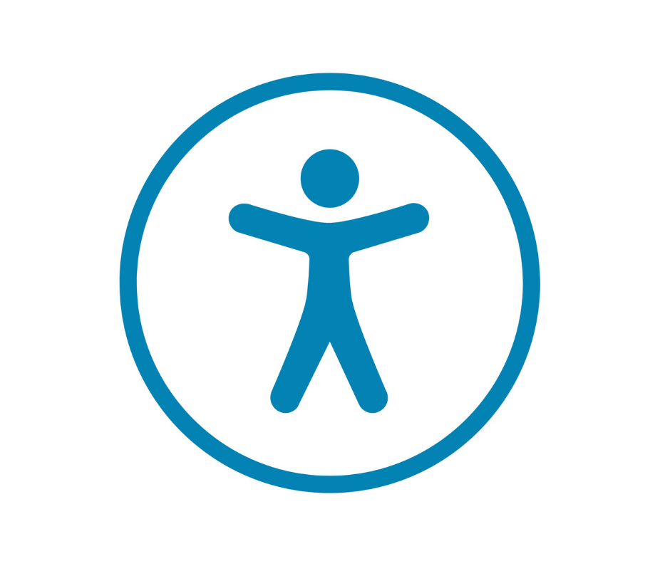

```{r}
#| eval: true 
#| echo: false
#| fig-align: "center"
#| out-width: "40%" 
#| fig-alt: "The symbol for universal web accessibilty, a person standing with arms outstretched inside a circle"

```

::: {.center-text .body-text-s .gray-text}
Thy symbol for universal web accessibility. Image Source: [Designed to Inspire](https://www.designedtoinspire.com/blog/142365-searching-for-an-accessibility-symbol/)
:::

##  Required Packages {#pkgs}

*No coding required in this section!*

##  Required Data {#data}

*No data downloads required for this section*

##  Lecture Materials {#lecture-materials}

Part 5 is contained in one lesson:

::: {.center-text}
[**UX / UI**]{.teal-text .body-text-m}

[ lecture 5 slides](slides/part5-ux-ui-slides.qmd){.btn role="button" target="_blank"} 
:::
