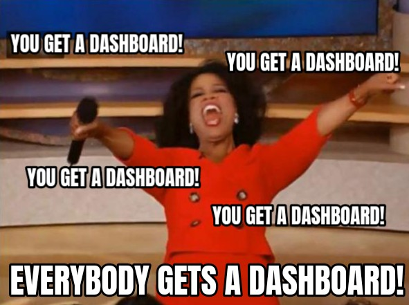

```{r}
#| eval: true 
#| echo: false
#| fig-align: "center"
#| out-width: "60%" 
#| fig-alt: "Oprah with her hands in the air yelling 'You get a dashboard! You get a dashboard! Everybody gets a dashboard!'"

```

::: {.center-text .body-text-s .gray-text}
But do you *really* need a dashboard? Image source: [X (formally Twitter)](https://twitter.com/pokateo_/status/1651968490863984640)
:::

##  Required Packages {#pkgs}

*No coding required in this section!*

##  Required Data {#data}

*No data downloads required for this section*

##  Lecture Materials {#lecture-materials}

Part 8 is contained in one lesson:

::: {.center-text}
[**Wrap up**]{.teal-text .body-text-m}

[ lecture 8 slides](slides/part8-wrap-up-slides.qmd){.btn role="button" target="_blank"} 
:::
