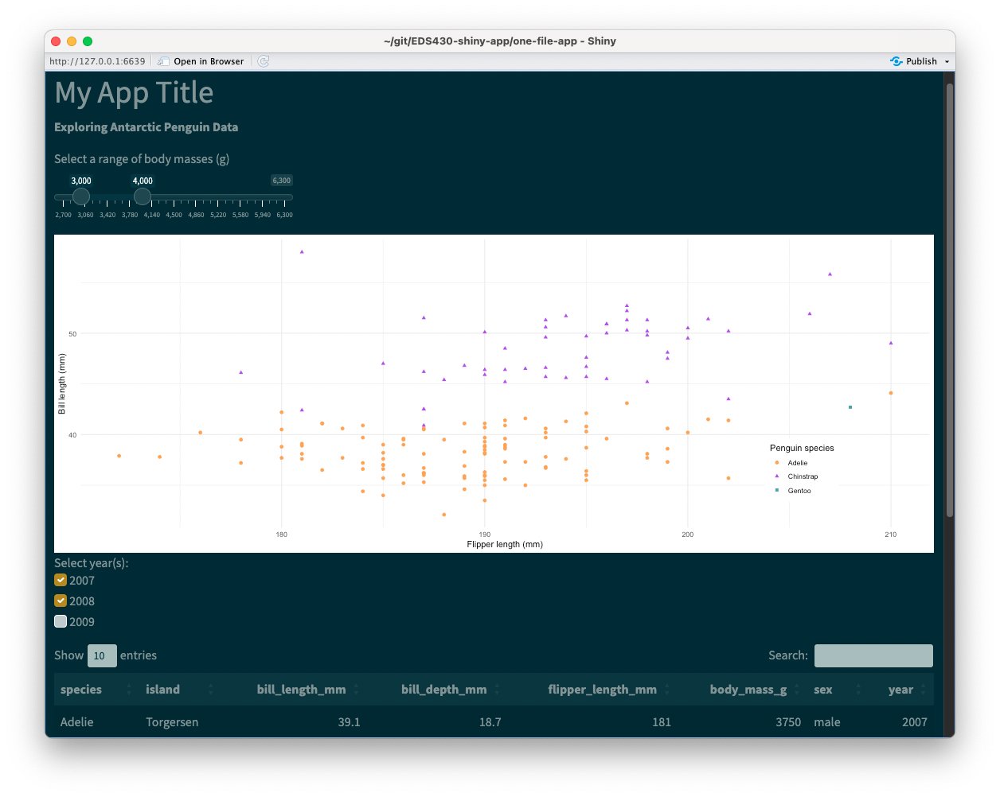
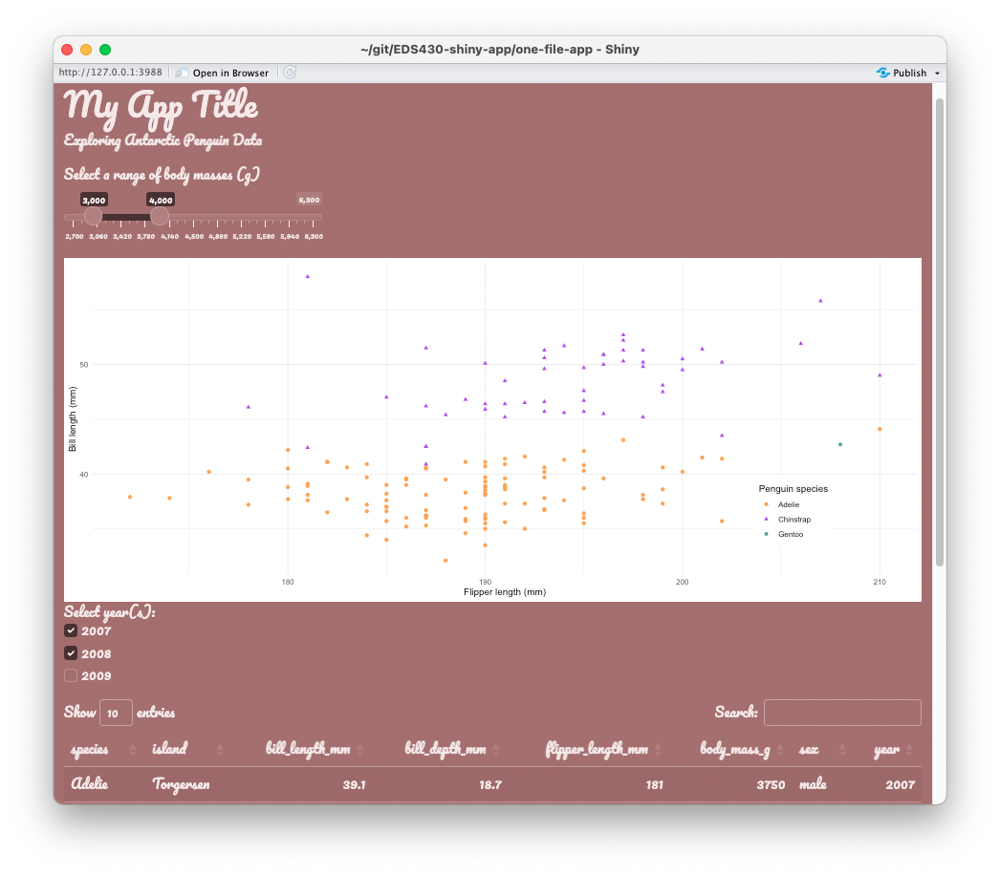
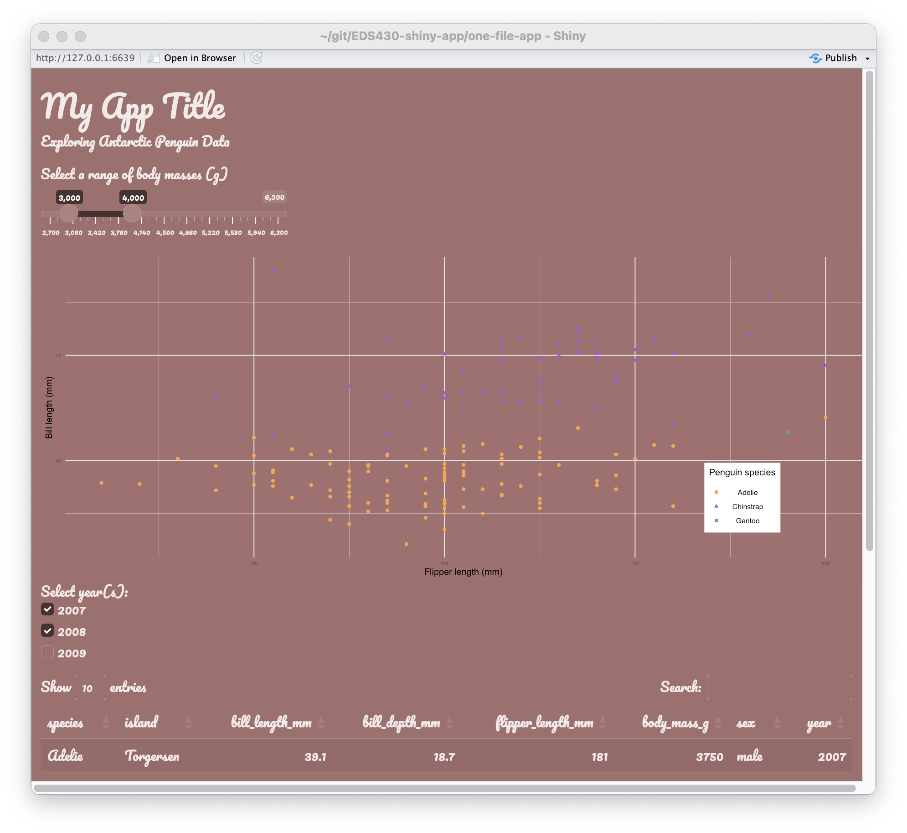
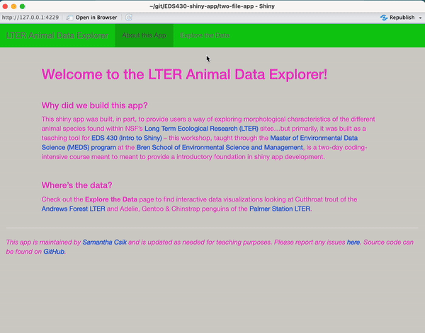
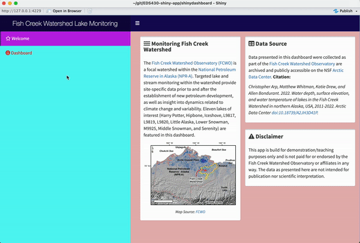

## {#title-slide data-menu-title="Title Slide" background="#053660"} 

[EDS 296: Part 4.1]{.custom-title}

[*Theming and styling apps with `{bslib}` & `{fresh}`*]{.custom-subtitle}

<hr class="hr-teal">

<!-- [Week 2 | February 2^nd^, 2024]{.custom-subtitle3} -->

---

##  {#theming-pkgs data-menu-title="~~~ Theming Shiny Apps (with pkgs) ~~~" background="#047C90"}

<div class="page-center vertical-center">
<p class="custom-subtitle bottombr"> Creating custom themes</p>
<p class="caption-text">*We've built some really cool apps so far, but they all have a pretty standard and similar appearance. In this section, we'll explore two packages for creating custom themes for your apps.*</p>
</div>

---

##  {#LO-theming data-menu-title="Learning Objectives - Theming/Styling"}

[ Learning Objectives - Theming/Styling Apps]{.slide-title}

<hr>

[By the end of this section, you should be equipped with:]{.body-text-l .teal-text}

. . . 

[[]{.teal-text} an understanding of how to use packaged-based tooling for theming and styling your shiny apps and dashboards]{.body-text-s}

<br>

. . .

[Packages introduced:]{.body-text-l .teal-text}

. . . 

[[]{.teal-text} `{bslib}`: provides tools for customizing Bootstrap themes directly from R for shiny apps and RMarkdown documents]{.body-text-s}

. . . 

[[]{.teal-text} `{fresh}`: provides tools for creating custom themes for use with shiny, `shinydashboard`, and `bs4Dash` apps]{.body-text-s}

---

##  {#bslib-fresh data-menu-title="{bslib} vs. {fresh}"}

[`{bslib}` & `{fresh}` both provide tooling for theming your applications]{.slide-title3}

<hr>

We won't cover all the major differences here, but you'll often find the following recommendations:

:::: {.columns}

::: {.column width="50%"}
::: {.center-text .body-text-m .teal-text}
Use [`{bslib}`](https://rstudio.github.io/bslib/){target="_blank"} for *shiny apps*
:::

- [Shiny's default UI components (e.g. `fluidPage()`, `sidebarLayout()`) are styled using [Bootstrap](https://getbootstrap.com/){target="_blank"}, a popular front-end framework for designing responsive web applications. The [`{bslib}` package](https://rstudio.github.io/bslib/){target="_blank"} provides tools for modifying Bootstrap variables.]{.body-text-s}
- [Try out themes using the [real-time theming widget](https://testing-apps.shinyapps.io/themer-demo/){target="_blank"} before applying them to your own app]{.body-text-s}
    
:::

::: {.column width="50%"}
::: {.center-text .body-text-m .teal-text}
Use [`{fresh}`](https://dreamrs.github.io/fresh/){target="_blank"} for *shinydashboards*
:::

- [`{bslib}` is not (currently) compatible with `{shinydashboard}`]{.body-text-s} 
- [`{shinydashboard}` is built on the [AdminLTE](https://adminlte.io/){target="_blank"} framework. `{fresh}` is specifically designed to modify AdminLTE elements.]{.body-text-s}  
:::
::::

---

##  {#bslib-practice data-menu-title="~~~ {bslib} pracitce ~~~" background="#047C90"}

<div class="page-center vertical-center">
<p class="custom-subtitle bottombr">`{bslib}` practice</p>
<p class="caption-text">*Let's start by applying a pre-built Bootswatch theme to our `single-file-app` using `{bslib}`, then create / apply a more customized theme.*</p>
</div>

<!-- --- -->

<!-- ##  {#bslib data-menu-title="{bslib}"} -->

<!-- [Using the [`{bslib}` package](https://rstudio.github.io/bslib/){target="_blank"} to theme Shiny apps]{.slide-title2} -->

<!-- <hr> -->

<!-- Shiny's default UI components (e.g. `navbarPage()`, `sidebarLayout()`) are styled using [Bootstrap](https://getbootstrap.com/){target="_blank"}, a popular front-end framework for designing responsive web applications. The [`{bslib}` package](https://rstudio.github.io/bslib/){target="_blank"} provides tools for modifying Bootstrap variables. -->

<!-- <!-- The [`{bslib}` package](https://rstudio.github.io/bslib/){target="_blank"} provides a modern UI toolkit for Shiny and R Markdown based on [Bootstrap](https://getbootstrap.com/){target="_blank"}, making custom theming for Shiny apps (and R Markdown docs!) quite easy. --> 

<!-- :::: {.columns} -->

<!-- ::: {.column width="50%"} -->
<!-- ::: {.center-text .body-text-l .teal-text} -->
<!-- Pros: -->
<!-- ::: -->
<!-- [[]{.teal-text} easy to use]{.body-text-s} -->

<!-- [[]{.teal-text} includes a [real-time theming widget](https://testing-apps.shinyapps.io/themer-demo/){target="_blank"} to try out themes before applying them to your own app]{.body-text-s} -->

<!-- <!-- [[]{.teal-text} plays well with the `{thematic}` package for matching plot styling to app]{.body-text-s} --> 

<!-- [[]{.teal-text} `{bslib}` does more than just theming! Read more on their [pkgdown site](https://rstudio.github.io/bslib/index.html){target="_blank"}]{.body-text-s} -->
<!-- ::: -->

<!-- ::: {.column width="50%"} -->
<!-- ::: {.center-text .body-text-l .teal-text} -->
<!-- Cons: -->
<!-- ::: -->
<!-- [[]{.teal-text} does **not** work with `shinydashboard` (`{bslib}` is only intended for use with `shiny` *apps*), though one of the latest releases includes tooling to create and customize dashboard-style shiny apps -- check out their [vignette](https://rstudio.github.io/bslib/articles/dashboards/){target="_blank"} for more]{.body-text-s} -->

<!-- [[]{.teal-text} styling is constrained to Bootstrap variables / the arguments available to `bs_theme()`]{.body-text-s} -->
<!-- ::: -->

<!-- :::: -->

<!-- <br> -->

<!-- . . .  -->

<!-- ::: {.center-text} -->
<!-- **Let's practice applying new themes using `{bslib}` to our `one-file-app` (i.e. App #1)** -->
<!-- ::: -->

---

##  {#bslib-prebuilt-themes data-menu-title="Pre-built themes with {bslib}"}

[Apply a pre-built theme with `{bslib}`]{.slide-title}

<hr>

Apply a pre-built [bootswatch theme](https://bootswatch.com/){target="_blank"} using `bs_theme()` (for a list of theme names, run `bootswatch_themes()` in your console):

<br>

<!-- [By default, Shiny uses the Bootstrap v3 theme (which is not so exciting). Change the theme to a slightly more modern Bootstrap v5 theme by setting the `theme` argument of `fluidPage()` to `bslib::bs_theme(version = 5)`, *or* supply `bs_theme()` with a pre-built bootswatch theme, as shown below (for a list of theme names, run `bootswatch_themes()` in your console):]{.body-text-s} -->

:::: {.columns}

::: {.column width="50%"}

<br>

```{r filename="~/single-file-app/ui.R"}
#| eval: false
#| echo: true
library(shiny)
library(bslib)
# ~ additional libraries omitted for brevity ~

ui <- fluidPage(
  
  theme = bs_theme(bootswatch = "solar"),
  
  # ~ additional UI code omitted for brevity ~
  
)
```

[Check out the complete [source code](https://github.com/samanthacsik/EDS-296-shiny-apps/tree/main/single-file-app){target="_blank"} for App #1 (NOTE: applied themes are commented out).]{.body-text-s}
:::

::: {.column width="50%"}
```{r}
#| eval: true
#| echo: false
#| fig-align: "center"
#| out-width: "100%"
#| fig-alt: "A shiny app depicting a title, subtitle sliderInput, scatterplot, checkboxGroupInput, and DT datatable, all stacked vertically. The pre-build bootswatch 'solar' theme has been applied, turning the background color dark blue and changing widget colors to dark gray or yellow. The background of the scatterplot is still white."

```
:::

::::

---

##  {#bslib-custom-themes data-menu-title="Custom themes with {bslib}"}

[Create a custom theme with `{bslib}`]{.slide-title}

<hr>

[Alternatively, you can customize your own theme. Explore the [`{bslib}` pkgdown site](https://rstudio.github.io/bslib/index.html){target="_blank"} for detailed instructions. A small example here:]{.body-text-s}

:::: {.columns}

::: {.column width="50%"}
<br>
```{r filename="~/single-file-app/ui.R"}
#| eval: false
#| echo: true
library(shiny)
library(bslib)
# ~ additional libraries omitted for brevity ~

ui <- fluidPage(
  
  theme = bs_theme(
    bg = "#A36F6F", # background color
    fg = "#FDF7F7", # foreground color
    primary = "#483132", # primary accent color
    base_font = font_google("Pacifico")),
  
  # ~ additional UI code omitted for brevity ~
  
)
```

[Check out the complete [source code](https://github.com/samanthacsik/EDS-296-shiny-apps/tree/main/single-file-app){target="_blank"} for App #1 (NOTE: applied themes are commented out).]{.body-text-s}
:::

::: {.column width="50%"}
```{r}
#| eval: true
#| echo: false
#| fig-align: "center"
#| out-width: "100%"
#| fig-alt: "A shiny app depicting a title, subtitle sliderInput, scatterplot, checkboxGroupInput, and DT datatable, all stacked vertically. A custom theme, created using bs_theme() has been applied, turning the background color pink, changing widget colors to a dark magenta, and applying a cursive white font styling to all text. The background of the scatterplot is still white."

```
:::

::::

::: {.footer}
Be sure to check out the interactive theming widget to test custom color / font / etc. combos by running `bs_theme_preview()` in your console, or visit the [hosted version](https://testing-apps.shinyapps.io/themer-demo/){target="_blank"}. You can also call `bs_themer()` within your `server` function to open the theme customization UI alongside your own app.
:::

<!-- ---- -->

<!-- ##  {#thematic data-menu-title="{thematic} for plot theming"} -->

<!-- [Use `{thematic}` to extend your theme to plots]{.slide-title2} -->

<!-- <hr> -->

<!-- [You probably noticed that our scatterplot looks a little silly against the darker background of our themed app. Enter the [`{thematic}` package](https://rstudio.github.io/thematic/index.html){target="_blank"}, which is built to help simplify plot theming. Call `thematic_shiny()` before launching your app to generate plots that reflect your application's `bs_theme()`. For example:]{.body-text-s} -->

<!-- :::: {.columns} -->

<!-- ::: {.column width="50%"} -->
<!-- ```{r filename="~/single-file-app/ui.R"} -->
<!-- #| eval: false -->
<!-- #| echo: true -->
<!-- #| code-line-numbers: "5" -->
<!-- library(shiny) -->
<!-- library(bslib) -->
<!-- # ~ additional libraries omitted for brevity ~ -->

<!-- thematic::thematic_shiny() -->

<!-- ui <- fluidPage( -->

<!--   theme = bs_theme( -->
<!--     bg = "#A36F6F", # background color -->
<!--     fg = "#FDF7F7", # foreground color -->
<!--     primary = "#483132", # primary accent color -->
<!--     base_font = font_google("Pacifico")), -->

<!--   # ~ additional UI code omitted for brevity ~ -->

<!-- ) -->
<!-- ``` -->

<!-- [Check out the complete [source code](https://github.com/samanthacsik/EDS-296-shiny-apps/tree/main/single-file-app){target="_blank"} for App #1 (NOTE: applied themes are commented out).]{.body-text-s} -->

<!-- ::: -->

<!-- ::: {.column width="50%"} -->
<!-- ```{r} -->
<!-- #| eval: true -->
<!-- #| echo: false -->
<!-- #| fig-align: "center" -->
<!-- #| out-width: "80%" -->
<!-- #| fig-alt: "A shiny app depicting a title, subtitle sliderInput, scatterplot, checkboxGroupInput, and DT datatable, all stacked vertically. A custom theme, created using bs_theme() has been applied, turning the background color pink, changing widget colors to a dark magenta, and applying a cursive white font styling to all text. The background of the scatterplot is now the same color (pink) as the background." -->
<!--  -->
<!-- ``` -->
<!-- ::: -->

<!-- :::: -->

<!-- ::: {.footer} -->
<!-- Check out the [pkgdown site](https://rstudio.github.io/thematic/index.html){target="_blank"} to learn more about using `{thematic}` to match plot fonts to the fonts applied across your app. -->
<!-- ::: -->

---

##  {#fresh-practice data-menu-title="~~~ {fresh} pracitce ~~~" background="#047C90"}

<div class="page-center vertical-center">
<p class="custom-subtitle bottombr">`{fresh}` practice</p>
<p class="caption-text">*We can use `{fresh}` to theme both shiny apps and dashboards, and the process is a little bit more involved than using `{bslib}`. Let's practice on both our `two-file-app` and our `shinydashboard`*</p>
</div>

<!-- --- -->

<!-- ##  {#fresh data-menu-title="{fresh}"} -->

<!-- [Using the [`{fresh}` package](https://dreamrs.github.io/fresh/){target="_blank"} to theme Shiny apps & dashboards]{.slide-title} -->

<!-- <hr> -->

<!-- [The [`{fresh}` package](https://dreamrs.github.io/fresh/){target="_blank"} provides tools for creating custom themes for *both* Shiny apps and dashboards -- set parameters of your theme using `create_theme()`, generate a stylesheet based off your specifications, and apply your stylesheet to your app.]{.body-text-s} -->

<!-- <br> -->

<!-- :::: {.columns} -->

<!-- ::: {.column width="45%"} -->
<!-- ::: {.body-text-l .teal-text} -->
<!-- Pros: -->
<!-- ::: -->

<!-- [[]{.teal-text} still pretty easy to use]{.body-text-s} -->

<!-- [[]{.teal-text} supports theming for shiny dashboards (unlike `{bslib}`; also supports `{flexdashboard}`s and [`{b4dash}` applications](https://rinterface.github.io/bs4Dash/index.html){target="_blank"})]{.body-text-s} -->
<!-- ::: -->

<!-- ::: {.column width="4%"} -->
<!-- ::: -->

<!-- ::: {.column width="45%"} -->
<!-- ::: {.body-text-l .teal-text} -->
<!-- Cons: -->
<!-- ::: -->

<!-- [[]{.teal-text} styling is constrained by the variables available to `create_theme()`]{.body-text-s} -->

<!-- COME BACK TO THIS -->
<!-- ::: -->

<!-- :::: -->

<!-- <br> -->

<!-- . . .  -->

<!-- ::: {.center-text} -->
<!-- **Let's practice applying new themes using `{fresh}` to our `two-file-app` (i.e. App #2) and our `shinydashbaord` (i.e. App #3)** -->
<!-- ::: -->

---

##  {#fresh-workflow data-menu-title="{fresh} workflow"}

[A general workflow for using `{fresh}` themes]{.slide-title2}

<hr>

Whether you're working on a shiny *app* or a shiny *dashboard*, you'll need the following:

[[**(1)**]{.teal-text} a `www/` folder within your app's directory -- this is where we'll save the stylesheet (a `.css` file) that `{fresh}` will generate for us]{.body-text-s}

[[**(2)**]{.teal-text} a separate script for building our theme using the `create_theme()` function -- I recommend saving this to `scratch/` (it seemed to cause issues when saved anywhere within my app directory)]{.body-text-s}

. . .

<br>

Importantly, `create_theme()` takes **different variables** to set the parameters of your theme, depending on what type of app you're building: for **shiny apps**, you'll need to use [`bs_vars_*` variables](https://dreamrs.github.io/fresh/articles/vars-shiny.html){target="_blank"}, and for **shiny dashboards** you'll use [`adminlte_*` variables](https://dreamrs.github.io/fresh/articles/vars-shinydashboard.html){target="_blank"} (examples on the following slides).

There are also a [couple ways](https://cran.r-project.org/web/packages/fresh/vignettes/fresh.html){target="_blank"} to apply your finished theme to your app, but we'll use the method of generating a `.css` file, then calling that file in our app.

---

##  {#create-fresh-app-theme data-menu-title="Create {fresh} app theme"}

[Creating a `{fresh}` theme for `two-file-app`]{.slide-title3}

<hr>

[In this example, we update the colors of our app's body, navbar, and tabPanels using the appropriate `{fresh}` [variables for shiny *apps*](https://dreamrs.github.io/fresh/articles/vars-shiny.html){target="_blank"}. We specify a file path, `two-file-app/www` (you'll need to create the `www/` directory, since we don't have one yet), where our stylesheet (e.g. `shiny-fresh-theme.css`, as shown here) file will be saved to. Of course, these color combos are *not* recommended, but chosen purely for demonstration purposes .]{.body-text-s}

```{r filename="~/R/create-fresh-theme-shiny.R"}
#| eval: false
#| echo: true
# load library ----
library(fresh)

# create theme -----
create_theme(
  
  theme = "default", # you can supply a bootstrap theme to begin with
  
  bs_vars_global( # global styling
    body_bg = "#D2D0CA", # beige
    text_color = "#F23ACB", # hot pink
    link_color = "#0E4BE3" # royal blue
  ),
  
  bs_vars_navbar( # navbar styling
    default_bg = "#13CC13", # lime green
    default_color = "#66656C" # gray
  ),
  
  bs_vars_tabs( # tab styling
    border_color = "#F90909" # red
  ),
  
  output_file = "two-file-app/www/shiny-fresh-theme.css" # generate css file & save to www/
)
```

---

##  {#apply-fresh-apps-theme data-menu-title="Apply {fresh} app theme"}

[Apply a `{fresh}` theme to our app]{.slide-title}

<hr>

To apply our theme, provide the `theme` argument of your `fluidPage()` or `navbarPage()` with the name of our stylesheet. **Note:** shiny knows to look in the `/www` directory, so you can omit that from your file path, as shown below:

<br>

:::: {.columns}

::: {.column width="50%"}

<br>

```{r filename="~/two-file-app/ui.R"}
#| eval: false
#| echo: true
# navbar page ----
ui <- navbarPage(

  theme = "shiny-fresh-theme.css",
  
  # ~ additional UI code omitted for brevity ~
  
) # END navbarPage
```

[Check out the complete [source code](https://github.com/samanthacsik/EDS-296-shiny-apps/tree/main/two-file-app){target="_blank"} for App #2 (NOTE: applied themes are commented out).]{.body-text-s}

:::

::: {.column width="50%"}
```{r}
#| eval: true
#| echo: false
#| fig-align: "center"
#| out-width: "80%"
#| fig-alt: "An app with a tan-colored background, lime green navbar, bright pink text, and blue links, showcasing how different components of a shiny app can be modified using the fresh packages."

```
:::

::::

---

##  {#fresh-shinydashboard data-menu-title="{fresh} shiny dashboard"}

[Creating a `{fresh}` theme for our `shinydashboard`]{.slide-title3}

<hr>

[In this example, we update the colors of our app's header, body, and sidebar using the appropriate `fresh` [variables for shiny *dashboards*](https://dreamrs.github.io/fresh/articles/vars-shinydashboard.html){target="_blank"}. We specify a file path, `shinydashboard/www/` where our stylesheet (e.g. `shinydashboard-fresh-theme.css`, as shown here) file will be saved to. Again, these color combos are *not* recommended, but chosen purely for demonstration purposes.]{.body-text-s}

```{r filename="~/R/create-fresh-theme-shinydashboard.R"}
#| eval: false
#| echo: true
# load libraries ----
library(fresh)

# create theme ----
create_theme(
  
  # change "light-blue"/"primary" color
  adminlte_color(
    light_blue = "#150B5A" # dark blue
  ),
  
  # dashboardBody styling (includes boxes)
  adminlte_global(
    content_bg = "#E7B5B5" # blush pink
  ),
  
  # dashboardSidebar styling
  adminlte_sidebar(
    width = "400px", 
    dark_bg = "#57F8F3", # light blue
    dark_hover_bg = "#BF21E6", # magenta
    dark_color = "#F90000" # red
  ),
  output_file = "shinydashboard/www/shinydashboard-fresh-theme.css" # generate css file & save to www/
)
```

---

##  {#apply-fresh-dashboard-theme data-menu-title="Apply {fresh} dashboard theme"}

[Apply a `{fresh}` theme to our dashboard]{.slide-title2}

<hr>

To apply our theme, use the `fresh::use_theme()` function inside your `dashboardBody`, providing it with the name of your stylesheet. **Note:** shiny knows to look in the `www/` directory, so you can omit that from your file path, as shown below:

<br>

:::: {.columns}

::: {.column width="50%"}

<br>

```{r filename="~/shinydashboard/ui.R"}
#| eval: false
#| echo: true
body <- dashboardBody(
  
  # set theme
  fresh::use_theme("shinydashboard-fresh-theme.css"),
  
  # ~ additional dashboardBody code omitted for brevity ~
  
)
```

[Check out the complete [source code](https://github.com/samanthacsik/EDS-296-shiny-apps/tree/main/shinydashboard){target="_blank"} for the shinydashboard (NOTE: applied themes are commented out).]{.body-text-s}

:::

::: {.column width="50%"}
```{r}
#| eval: true
#| echo: false
#| fig-align: "center"
#| out-width: "80%"
#| fig-alt: "A shinydashboard with a dark blue dashboardHeader, pink dashboardBody, light blue dashboardSidebar, red sidebar text, and bright pink sidebar menuItem highlights, showcasing how shinydashboards can be customized using the fresh package."

```
:::

::::

---

##  {#end data-menu-title="~~~ BREAK ~~~" background="#047C90"}

<div class="page-center vertical-center">
<p class="custom-subtitle bottombr">End part 4.1</p>
<p class="caption-text">***Up next:** fully custom themes using CSS & Sass*</p>
</div>

```{r}
countdown::countdown(
  minutes = 5,
  # left = 0, right = 0,
  # Fanfare when it's over
  # play_sound = TRUE,
  color_border              = "#FFFFFF",
  color_text                = "#7aa81e",
  color_running_background  = "#7aa81e",
  color_running_text        = "#FFFFFF",
  color_finished_background = "#ffa07a",
  color_finished_text       = "#FFFFFF",
  font_size = "2em",
  )
```
