## {#title-slide data-menu-title="Title Slide" background="#053660"} 

[EDS 296: Part 7.2]{.custom-title}

[*Unit Testing (abridged version)*]{.custom-subtitle}

<hr class="hr-teal">

<!-- [Week 2 | February 2^nd^, 2024]{.custom-subtitle3} -->

*[Explore the [complete lesson](part7.2-unit-testing-slides.qmd){target="_blank"} for additional testing examples]{.custom-subtitle3}*

<!-- --- -->

<!-- ##  {#testing data-menu-title="~~~ Unit Testing ~~~" background="#047C90"} -->

<!-- <div class="page-center vertical-center"> -->
<!-- <p class="custom-subtitle bottombr"> Unit Testing</p> -->
<!-- <p class="caption-text">*Creating automated tests for your apps can save time and effort, ensuring that they continue working as expected.*</p> -->
<!-- </div> -->

<!-- --- -->

<!-- ##  {#LO-testing data-menu-title="Learning Objectives - Unit Testing"} -->

<!-- [ Learning Objectives]{.slide-title} -->

<!-- <hr> -->

<!-- <p class="body-text-l teal-text bottombr">After this section, you should:</p> -->

<!-- . . .  -->

<!-- []{.teal-text} understand some of the reasons why apps break and the benefit of having automated tests -->

<!-- . . .  -->

<!-- []{.teal-text} understand the concept of a unit test, assertions, and using a testing framework to construct tests -->

<!-- . . .  -->

<!-- []{.teal-text} have a basic understanding of how to use the `{shinytest2}` package to write appropriately scoped unit tests for Shiny apps -->

<!-- . . .  -->

<!-- []{.teal-text} know how to rerun and update tests as necessary -->

<!-- . . .  -->

<!-- <p class="body-text-l teal-text topbr">Packages introduced:</p>  -->

<!-- . . . -->

<!-- []{.teal-text} `{testthat}`:  provides tools for writing unit tests in R -->

<!-- . . .  -->

<!-- []{.teal-text} `{shinytest2}`:  provides tools for creating and running automated tests on Shiny applications; built on top of the `{testthat}` package -->

<!-- . . .  -->

<!-- []{.teal-text} `{diffviewer}`:  an HTML widget for visually comparing files -->

---

##  {#what-is-testing data-menu-title="What is testing?"}

[What exactly does "testing" mean?]{.slide-title}

<hr>

Generally speaking, testing refers to **the act of evaluating / verifying if a software product or application does what we expect it to do**. 

<br>

. . .

There are lots of different *types* of testing. To name just a few:

- [**Unit testing**, where isolated source code (e.g. functions, modules) is tested to validate expected behavior]{.body-text-s}
- [**Integration testing**, where various software units or modules are tested as a combined unit (e.g. testing if your app and an API can communicate as intended)]{.body-text-s}
- [**Performance testing** (which includes things like **load testing**, **stress testing**, etc.), where software is tested for its responsiveness and stability under a particular workload]{.body-text-s}

. . .

Tests can be:

- [**Performed manually**, where a person interacts with code (e.g. tests a function, plays with an app feature) to identify bugs, errors, anomalies, etc.]{.body-text-s}
- [**Automated**, where a person uses test scripts and programs to automate user interactions and validate assumed behavior]{.body-text-s}

---

##  {#automated-unit-testing data-menu-title="Automated unit testing"}

[Here, we'll focus on automated unit testing]{.slide-title}

<hr>

Generally speaking, testing refers to **the act of evaluating / verifying if a software product or application does what we expect it to do**. 

<br>

There are lots of different *types* of testing. To name just a few:

- [**Unit testing**, where isolated source code (e.g. functions, modules) is tested to validate expected behavior]{.body-text-s .teal-text}
- [**Integration testing**, where various software units or modules are tested as a combined unit (e.g. testing if your app and an API can communicate as intended)]{.body-text-s}
- [**Performance testing** (which includes things like **load testing**, **stress testing**, etc.), where software is tested for its responsiveness and stability under a particular workload]{.body-text-s}

Test can be:

- [**Performed manually**, where a person interacts with code (e.g. tests a function, plays with an app feature) to identify bugs, errors, anomalies, etc.]{.body-text-s}
- [**Automated**, where a person uses test scripts and programs to automate user interactions and validate assumed behavior]{.body-text-s .teal-text}

---

##  {#requirements data-menu-title="Requirements"}

[For automated unit testing, we need . . .]{.slide-title}

<hr>

::: {.incremental}
1. **some small unit of code** you want to test (e.g. a function)
2. **assertions** i.e. statements or conditions that verify the expected behavior of your unit of code (in other words, does the actual output match the expected output?)
3. **a framework** for writing and executing your tests
:::

. . . 

**Different languages have different testing frameworks. For example:**

- [Playwrite](https://playwright.dev/python/){target="_blank"} (see [Shiny for Python resources](https://shiny.posit.co/py/docs/end-to-end-testing.html){target="_blank"}) [unittest](https://docs.python.org/3/library/unittest.html){target="_blank"} or [pytest](https://pypi.org/project/pytest/){target="_blank"} for Python
- [Jest](https://jestjs.io/){target="_blank"} for JavaScript
- [testthat](https://testthat.r-lib.org/) for R

. . . 

::: {.center-text .body-text-m}
Before we try writing tests for a Shiny app, let's first consider a small (non-Shiny) example using the `{testthat}` framework. We'll explore a testable unit of code, define assertions, and write / run tests. You can fork and clone [this GitHub repository](https://github.com/UCSB-MEDS/testthat-unit-tests){target="_blank"} or create / add code to your own.
:::

----

##  {#say_hello data-menu-title="say_hello()"}

[1. Let's consider this small unit of code:]{.slide-title}

<hr>

Provide this function with a name, and it will return a greeting! If you don't give it a character string it throws a helpful error message:

```{r filename="~/R/say_hello.R"}
#| eval: true
#| echo: true
say_hello <- function(name = NULL) {
  if (!is.character(name)) {
    stop("Please include a name as a character string for me to greet!")
  } else {
    greeting <- paste0("Hello ", name, "!")
    print(greeting)
  }
}
```

. . . 

Manually test it out:

```{r filename="Console"}
#| eval: true
#| echo: true
say_hello("Sam")
```

. . . 

What happens when you give it something unexpected? For example:

```{r filename="Console"}
#| eval: false
#| echo: true
say_hello(123)
say_hello()
```

---

##  {#say_hello-assertions data-menu-title="say_hello() assertions"}

[2. Define your assertions]{.slide-title}
 
<hr>

Before we write any tests, it's helpful to jot down (in your own words) the expected behavior of this unit of code (`say_hello()`). These expectations will form the basis of the [assertions](https://en.wikipedia.org/wiki/Test_assertion){target="_blank"} made in your tests.

. . . 

I find it helpful to make a table that outlines both [**(a)**]{.teal-text} what possible **actions** can be taken by a user? and [**(b)**]{.teal-text} what are the **expected outputs / behaviors** that result from those actions?

<br>

. . . 

[**For example:**]{.teal-text .body-text-l} 

| Action(s)                                                                                      | Expectation(s)                                             |
|------------------------------------------------------------------------------------------------|------------------------------------------------------------|
| User provides a name as a character string as intended, e.g. `"Sam"`                           | Function returns `"Hello Sam!"`                            |
| User provides a numeric value, e.g. `123` | Function returns an error message that reads, `"Please include a name as a character string for me to greet!"` |
| User runs the function without providing an input | Function returns an error message that reads, `"Please include a name as a character string for me to greet!"` |


---

##  {#say_hello-testthat-intro data-menu-title="say_hello() testthat intro"}

[3. Build and run tests using `{testthat}`]{.slide-title}
 
<hr>

:::: {.columns}

::: {.column width="40%"}
```{r}
#| eval: true
#| echo: false
#| out-width: "1000%"
#| fig-align: "center"

```
:::

::: {.column width="60%" .center-text}

<br>

[The [`{testthat}` package](https://testthat.r-lib.org/){target="_blank"} is the go-to framework for writing unit tests in R.]{.body-text-m} 

<br>

The best (and encouraged) way to build and run these tests is by first turning your project into an R package. While we won't be doing that here, we'll still use `{testthat}` functions to construct our unit tests. Repository structure<sup>1</sup> is important (regardless of turning your project into a package) -- **be sure to follow the structure as defined by [our example repo](https://github.com/UCSB-MEDS/testthat-unit-tests?tab=readme-ov-file#repository-structure).** 
:::
::::

::: {.footer}
<sup>1</sup>**Please be aware:** The required repository structure when using `{testthat}` in a package context differs from our non-package example here.
:::

---

##  {#say_hello-testthat-anatomy data-menu-title="say_hello() testthat anatomy"}

[3. Build and run tests using `{testthat}`]{.slide-title}
 
<hr>

The anatomy of a `{testthat}` tests generally looks like this:

```{r}
#| eval: false
#| echo: true
test_that("a short descriptive name for your test", {
  expect_output(my_function(<a_known_input>, ...), <the_resulting_expected_output>) 
})
```

. . . 

For example: 

```{r}
#| eval: false
#| echo: true
test_that("say_hello works with a string", {
  expect_output(say_hello("Sam"), "Hello Sam!") 
})
```

<br>

. . . 

::: {.incremental}
- there are a number of different `expect_*()` functions you might use
- keep tests *small*: 
  - [easier to debug]{.body-text-s}
  - [lets you test edge cases and specific scenarios]{.body-text-s}
  - [easier to maintain (can easily update / remove a specific small test than untangle a large, complex one)]{.body-text-s}
  - [encourages modular code design]{.body-text-s}
  - [act as mini-examples / documentation about how your codes should behave]{.body-text-s}
:::

---

##  {#say_hello-testthat-tests data-menu-title="say_hello() testthat tests"}

[3. Build and run tests using `{testthat}`]{.slide-title}
 
<hr>

[Tests files *must* begin with the prefix, `test`. By convention, this is followed by the name of the file / function being tested. For example, if your function is in a file named `say_hello.R`, the corresponding test file should be named `test_say_hello.R`.]{.body-text-s}

[Be sure to import the `{testthat}` package and source your function file at the top of your test file, then add tests for each of your table items (see [this slide](part7.2-unit-testing-slides-ABRIDGED.qmd#say_hello-assertions)). Consider which `expect_*()` function is most appropriate for each test.]{.body-text-s}

```{r filename="~/tests/test_say_hello.R"}
#| eval: false
#| echo: true
#..........................load packages.........................
library(testthat)

#...........................source fxn...........................
source(here::here("R", "say_hello.R"))

#..............................tests.............................
test_that("say_hello works with a string", { 
  expect_output(say_hello("Sam"), "Hello Sam!")
})

test_that("say_hello throws error when numeric value is provided", {
  expect_error(say_hello(123), "Please include a name as a character string for me to greet!")
})

test_that("say_hello throws error when no argument is provided", {
  expect_error(say_hello(), "Please include a name as a character string for me to greet!")
})
```

::: {.footer}
Run tests by clicking the **Run Tests** button at the top of your test file, or by running `test_file(here::here("tests", "test_say_hello.R"))`.
:::

---

##  {#assertions-note data-menu-title="A note on assertions"}

[One more important note (actually, a few)]{.slide-title}

<hr>

<br>

::: {.center-text}
As much as you try, **testing will never be exhaustive**. You can only test for scenarios that you think of.
:::

<br>

. . . 

::: {.center-text}
The goal is to **put yourself in the shoes of a user**, and test scenarios that you think your users will encounter. If you test those use-cases, you'll cover the majority of expectations.
:::

<br>

. . . 

::: {.center-text}
As users use your code or interact with your app, **they'll stumble upon and reveal use-cases / scenarios that you hadn't tested for**...and you can update your code / write tests accordingly.
:::

<br>

. . . 

::: {.center-text}
Over time, **your ability to identify both how users will use your software *and* what to test will improve**.
:::

---

##  {#app-testing data-menu-title="App testing"}

[Okay, but should I be testing my *apps*?]{.slide-title}

<hr>

Yes! Consider this workflow (which should look a bit familiar) . . .

1. Add / adjust some reactivity
2. Click "Run App"
3. Manually experiment with the new feature to see if it works 
5. Rinse & repeat

<br>

. . . 

But what if you have 20 apps? [Or many team members?]{.fragment .fade-in}

<br>

. . . 

**It becomes increasingly more challenging to remember all the features you need to test, or how each works.** Things can also get lost in translation with manual testing (e.g. can you explain to your coworker(s) *all* of your app's features and make sure that they manually test it properly?).

::: {.footer}
Slide adapted from Barret Schloerke's rstudio::conf(2022) talk, [`{shinytest2}`: Unit testing for Shiny applications](https://www.youtube.com/watch?v=DMgAW4m5aTI){target="_blank"}
:::

---

##  {#apps-break data-menu-title="Apps will break"}

[It's almost inevitable that our app(s) will break]{.slide-title2}

<hr>

There are lots of reasons why this happens, but to name a few:

::: {.incremental}
- [**you make changes to your app** (e.g. add new features, refactor code)]{.body-text-s}
- [**an external data source stops working** or returns data in a different format than that expected by your app]{.body-text-s}
:::

. . .

<br>

**Manually testing** Shiny apps is takes a lot of **time** and **effort**, is often **inconsistent**, and **doesn't scale** well (e.g. for larger apps, many apps, or for larger teams of collaborators).

. . . 

<br>

::: {.center-text .body-text-m}
It can save a lot of time and headache to have an automated system that checks if your app is working as expected.
:::

---

##  {#shinytest2 data-menu-title="{shinytest2}"}

[Enter the `{shinytest2}` package]{.slide-title}

<hr>

The [`{shinytest2}` package](https://rstudio.github.io/shinytest2/articles/shinytest2.html){target="_blank"} provides useful tools for **unit testing Shiny apps**. We'll use these unit tests to [**ensure that desired app behavior remains consistent, even after changes to the app's code**]{.teal-text} (the documentation refers to this type of unit testing as *regression testing* -- we'll use these tests to verify that app behavior *does not regress*).

:::: {.columns}

::: {.column width="50%"}

<br>
<br>

From the `{shinytest2}` documentation:

<p class="body-text-s quote-text-bg">"*`{shinytest2}` uses `{testthat}`’s snapshot-based testing strategy. The first time it runs a set of tests for an application, it performs some scripted interactions with the app and takes one or more snapshots of the application’s state. These snapshots are saved to disk so that future runs of the tests can compare their results to them.*"</p> 
:::

::: {.column width="50%"}

<br>

```{r}
#| eval: true
#| echo: false
#| out-width: "60%"
#| fig-align: "center"
#| fig-alt: "A hex that's split down the middle horizontally. The top half is the blue Shiny hex and the bottom half looks like the red {testthat} hex, except it reads 'test2'."

```
:::

::::

<!-- . . . -->

<!-- ::: {.center-text .body-text-s} -->
<!-- *With `{shinytest2}`, we can interact with our app via the "app recorder" and our test code will be automatically generated for us. We can then rerun tests to check for consistency as we iterate on our app.* -->
<!-- ::: -->

::: {.footer}
`{shinytest2}` uses [`{chromote}`](https://rstudio.github.io/chromote/){target="_blank"} to render your app in a headless [Chromium browser](https://www.chromium.org/chromium-projects/){target="_blank"} -- by default, it uses Google Chrome, so make sure you have that installed on your OS
:::

---

##  {#setting-stage data-menu-title="Setting the stage"}

[Let's imagine . . .]{.slide-title}

<hr>

[Your boss has tasked you with building a Shiny app, and asks that you begin with a feature that greets users by name. **If you've been following along with previous course modules, you can create a new folder, `testing-app/`, in your GitHub repo and add the following files. Alternatively, fork and clone [this repository](https://github.com/UCSB-MEDS/shinytest2-unit-tests){target="_blank"}.**]{.body-text-s}

<!-- --- -->

<!-- ##  {#starting-app data-menu-title="Starting app"} -->

<!-- [Let's start with the following app]{.slide-title} -->

<!-- <hr> -->

::: {.panel-tabset}
## `global.R`

```{r filename="~/testing-app/global.R"}
#| eval: false
#| echo: true
# load libraries ----
library(shiny)
```

## `ui.R`

```{r filename="~/testing-app/ui.R"}
#| eval: false
#| echo: true
ui <- fluidPage(

  # Feature 1 ------------------------------------------------------------------

  h1("Feature 1"),

  # fluidRow (Feature 1: greeting) ----
  fluidRow(

    # greeting sidebarLayout ----
    sidebarLayout(

      # greeting sidebarPanel ----
      sidebarPanel(

        textInput(inputId = "name_input",
                  label = "What is your name?"),

        actionButton(inputId = "greeting_button_input",
                     label = "Greet"),

      ), # END greeting sidebarPanel

      # greeting mainPanel ----
      mainPanel(

        textOutput(outputId = "greeting_output"),

      ) # END greeting mainPanel

    ) # END greeting sidebarLayout

  ), # END fluidRow (Feature 1: greeting)
  
) # END fluidPage 
```

## `server.R`

```{r filename="~/testing-app/server.R"}
#| eval: false
#| echo: true
server <- function(input, output) {
  
  # Feature 1 ------------------------------------------------------------------

  output$greeting_output <- renderText({

    req(input$greeting_button_input) # req(): textOutput doesn't appear until button is first pressed
    paste0("Hello ", isolate(input$name_input), "!") # isolate(): prevents textOutput from updating until button is pressed again

  }) 
}
```

:::

---

##  {#run-ft1-app data-menu-title="Run the app"}

[Manually test this feature]{.slide-title2}

<hr>

::: {.center-text}
Run the app and play around with the greeting generator: 
:::

```{r}
#| eval: true
#| echo: false
#| out-width: "80%"
#| fig-align: "center"
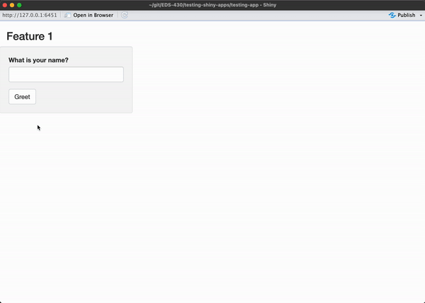
```

<br>

::: {.center-text}
Let's say that you are satisfied with your work (yay!) and are now ready to write some automated tests to ensure consistent behavior as you continue to build out additional features.
:::

---

##  {#ft1-assertions data-menu-title="Feature 1 assertions"}

[Write down your assertions]{.slide-title}

<hr>

Just like we did in our previous non-Shiny example, let's **jot down the expected behaviors of our application**. These will form the basis of the [assertions](https://en.wikipedia.org/wiki/Test_assertion){target="_blank"} made in our tests. It's again helpful to create a table that outlines both [**(a)**]{.teal-text} what **actions** can be taken by a user? and [**(b)**]{.teal-text} what are the **expected outputs / behaviors** that result from those actions?

<br>

. . . 

```{r}
# countdown::countdown(
#   minutes = 2,
#   # left = 0, right = 0,
#   # Fanfare when it's over
#   # play_sound = TRUE,
#   color_border              = "#FFFFFF",
#   color_text                = "#7aa81e",
#   color_running_background  = "#7aa81e",
#   color_running_text        = "#FFFFFF",
#   color_finished_background = "#ffa07a",
#   color_finished_text       = "#FFFFFF",
#   font_size = "2em",
#   )
```

[**For example:**]{.teal-text .body-text-l} 

| Action(s)                                                                                                               | Expectation(s)                                                           |
|-------------------------------------------------------------------------------------------------------------------------|--------------------------------------------------------------------------|
| Type [some text value] in text box > click Greet button                                                                 | Greeting output is "Hello [some text value]!"                            |
| Type [some text value] in text box > click Greet button > type [some other text value] in text box > click Greet button | Greeting output is "Hello [some text value]!", then updates to "Hello [some other text value]!" |
| Click Greet button                                                                                                      | Greeting output is "Hello !"                                             |

---

##  {#testing-procedure data-menu-title="Testing procedure"}

[Turn "plain language" assertions into actual tests using the `{shinytest2}` workflow]{.slide-title3}

<hr>

<br>

[**Generally speaking, that workflow looks something like this:**]{.teal-text}

<br>

. . . 

[**(1)**]{.teal-text} Run `shinytest2::record_test(<app-directory>)` in your Console to launch the app recorder in a browser window

<br>

. . . 

[**(2)**]{.teal-text} Interact with your application and tell the recorder to make an expectation of the app's state 

<br>

. . . 

[**(3)**]{.teal-text} Give your test a unique name and quit the recorder to save and execute your tests

<br>

. . . 

::: {.center-text .body-text-m}
We'll repeat this workflow to write tests for each of our three assertions.
:::

<!-- This workflow looks a bit different than that of the `{testthat}` -- we'll record our interactions with our application -->


<!-- because `{shinytest2}` automatically generates test code by simulating user interactions in a [headless browser](https://en.wikipedia.org/wiki/Headless_browser#:~:text=A%20headless%20browser%20is%20a,interface%20or%20using%20network%20communication.){target="_blank"}. -->

---

##  {#chromote-timeout data-menu-title="chromote time out"}

[FYI (a warning about chromote time outs)]{.slide-title2}

<hr>

<br>

`{shinytest2}` uses tests to simulating user interactions in a [headless browser](https://en.wikipedia.org/wiki/Headless_browser#:~:text=A%20headless%20browser%20is%20a,interface%20or%20using%20network%20communication.){target="_blank"} (i.e. a browser without a graphical user interface; often used for testing web pages). `{chromote}` is the R-based tool for opening a headless Chromium-based (e.g. Chrome) browser.

<br>

If you receive the following error message after running, `shinytest2::record_test("testing-app")`, you'll need to restart R:

<br>

```{r}
#| eval: false
#| echo: true
#| code-line-numbers: false
Caused by error:
! Chromote: timed out waiting for response to command Target.createTarget
```

<br>

It's a pretty annoying error, which seems to be an [ongoing issue](https://github.com/rstudio/chromote/issues/94){target="_blank"} with `{chromote}`. R may be slow to restart.

---

##  {#ft1-test1 data-menu-title="Feature 1, test 1"}

[Let's test our first assertion . . .]{.slide-title}

<hr>

...which is that when a user types [some text value] into the text box and clicks the Greet button (**i.e. the actions**), the greeting output will return `Hello [some text value]!` (**i.e. the expectation**). We'll substitute a known value (e.g. `Sam`) for [some text value] in our test.

<br>

:::: {.columns}

::: {.column width="50%"}
```{r}
#| eval: true
#| echo: false
#| out-width: "100%"
#| fig-align: "center"
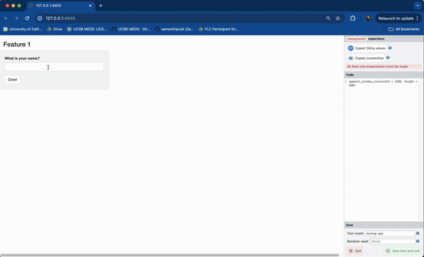
```
:::

::: {.column width="50%"}
[**Steps:**]{.teal-text}

[[**(1)**]{.teal-text} Run `shinytest2::record_test("testing-app")` in the Console]{.body-text-s}

[[**(2)**]{.teal-text} Type `Sam` into the text box > click the Greet button > click Expect Shiny Values]{.body-text-s}

[[**(3)**]{.teal-text} Give the test a unique name (e.g. `one-name-greeting`) > click Save test and exit]{.body-text-s}

[[**(4)**]{.teal-text} The test recorder will quit, and your test will automatically execute (it should pass!)]{.body-text-s}

:::
::::

::: {.center-text .body-text-s}
Notice that your actions (e.g. typing text, clicking the button) are recorded as code in the right-hand panel -- this is your test code, and it'll be saved when you quit the recorder.
:::

---

##  {#test-auto-executes data-menu-title="Tests auto execute"}

[Your test should automatically run (and pass!)]{.slide-title2}

<hr>

After quitting the test recorder, the following will happen: 

- [a test script will be saved in `testing-app/tests/testthat/test-shinytest2.R`]{.body-text-s}
- [if you're running in the RStudio IDE, `test-shinytest2.R` will automatically open in the editor]{.body-text-s} 
- [`shinytest2::test_app()` is run behind the scenes to execute the test script]{.body-text-s}

You should see something like this in your Console: 

```{r}
#| eval: false
#| echo: true
#| code-line-numbers: false
• Saving test runner: tests/testthat.R
✔ Adding 'shinytest2::load_app_support(test_path("../.."))' to 'tests/testthat/setup-shinytest2.R'
• Saving test file: tests/testthat/test-shinytest2.R
☐ Modify
  /Users/samanthacsik/git/EDS-296-1W/shinytest2-unit-tests/testing-app/tests/testthat/test-shinytest2.R.
• Running recorded test: tests/testthat/test-shinytest2.R
Loading required package: testthat
✔ | F W  S  OK | Context
✔ |   2      1 | shinytest2 [2.1s]                                                                  
────────────────────────────────────────────────────────────────────────────────────────────────────
Warning (test-shinytest2.R:8:3): {shinytest2} recording: one-name-greeting
Adding new file snapshot: 'tests/testthat/_snaps/shinytest2/one-name-greeting-001_.png'

Warning (test-shinytest2.R:8:3): {shinytest2} recording: one-name-greeting
Adding new file snapshot: 'tests/testthat/_snaps/shinytest2/one-name-greeting-001.json'
────────────────────────────────────────────────────────────────────────────────────────────────────

══ Results ═════════════════════════════════════════════════════════════════════════════════════════
Duration: 2.1 s

[ FAIL 0 | WARN 2 | SKIP 0 | PASS 1 ]
```

---

##  {#test-folder data-menu-title="Explore the tests/ folder"}

[Understanding the contents of `tests/`]{.slide-title}

<hr>

The first time you record a test, `{shinytest2}` generates number of directories / subdirectories, along with a bunch of files. The next few slides explain these in more detail.

<br>

After creating your first test, your repo structure should look something like this:
```{md}
#| eval: false
#| echo: true
#| code-line-numbers: false
.
├── testing-app/                                  
│   └── global.R                     
│   └── ui.R                         
│   └── server.R                      
│   └── tests/                    # generated the first time you record and save a test    
│      └── testthat.R             # see note below
│      └── testthat/     
│         └── setup-shinytest2.R  # see note below
│         └── test-shinytest2.R   # see next slides
│         └── snaps/               
│            └── shinytest2/      
│               └── *001.json     # see next slides
│               └── *001_.png     # see next slides
```

- [`testthat.R`: includes the code, `shinytest2::test_app()`, which is executed when you click the **Run Tests** button in RStudio]{.body-text-s}
- [`setup-shinytest2.R`: includes the code, `shinytest2::load_app_support()`, which loads any application support files (e.g. `global.R` and / or anything inside `R/`) into the testing environment]{.body-text-s}

---

##  {#test-shinytest2 data-menu-title="The test file"}

[`test-shinytest2.R` (test code)]{.slide-title}

<hr>

[The anatomy of our test should look a bit similar those generated for our `say_hello()` function using `{testthat}`. Here, however, we need to spin up our Shiny app in a headless browser, then simulate user interactions using the appropriate functions. All tests will be saved to `tests/testthat/test-shinytest2.R`]{.body-text-s}

```{r filename="~/testing-app/tests/testthat/test-shinytest2.R"}
#| eval: false
#| echo: true
library(shinytest2)

# runs our test
test_that("{shinytest2} recording: one-name-greeting", {

  # start Shiny app in a new R session along with chromote's headless browser that's used to simulate user actions
  app <- AppDriver$new(test_path("../.."), name = "one-name-greeting", height = 719, width = 595)

  # set the textInput (with Id `name_input`) to the value `Sam`
  app$set_inputs(name_input = "Sam")

  # click the actionButton (with Id `greeting_button_input`)
  app$click("greeting_button_input")

  # save the expected input, output, and export values to a JSON snapshot and generates a screenshot of the app
  app$expect_values()
})
```

::: {.footer}
Your test may have a different viewport height / width (depending on the size of your viewport when you recorded your test), and if you mistyped / deleted any characters in the textInput, you'll see multiple `app$set_inputs()` statements, reflecting these actions. You can delete these.
:::


---

##  {#snaps data-menu-title="The _snaps/ folder"}

[The `snaps/` folder]{.slide-title}

<hr>

[When `shinytest2::test_app()` runs your test code, it plays back the specified actions (e.g. setting the textInput to `Sam`, then clicking the Greet button), and records your application's resulting state as a snapshot. Snapshots are saved to the `tests/testthat/shinytest2/_snaps/` folder. You should see two different snapshot files:]{.body-text-s}

<br>

:::: {.columns}

::: {.column width="50%"}
::: {.center-text .body-text-s}
`one-name-greeting-001_.png`, a screenshot of the app when `app$expect_values()` was called:
```{r}
#| eval: true
#| echo: false
#| out-width: "80%"
#| fig-align: "center"
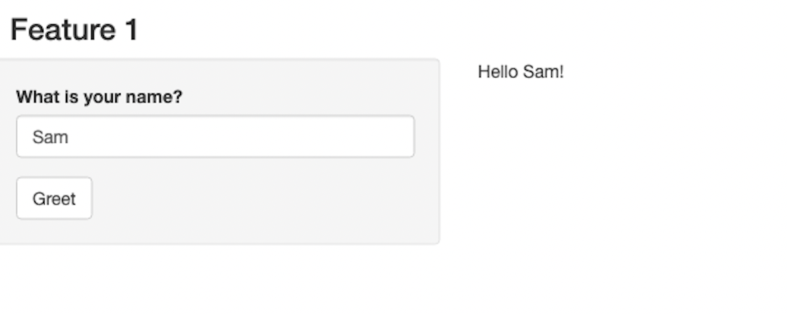
```
:::
:::

::: {.column width="50%"}
::: {.center-text .body-text-s}
`one-name-greeting-001.json`, a [JSON](https://www.json.org/json-en.html){target="_blank"} representation of the state of the app when `app$expect_values()` was called:
:::

```{json}
#| eval: false
#| echo: true
{
  "input": {
    "greeting_input": 1,
    "name_input": "Sam"
  },
  "output": {
    "greeting_output": "Hello Sam!"
  },
  "export": {

  }
}
```
:::

::::

::: {.footer}
We don't have any exported values in our app, and we won't be covering those here. Read more about exported values in the [`{shinytest2}` documentation](https://rstudio.github.io/shinytest2/articles/in-depth.html#exported-values){target="_blank"}.
:::

---

##  {#test-recap data-menu-title="Test recap"}

[A quick recap of our test files]{.slide-title}

<hr>

- **You can think of your test as a *recipe* for `{shinytest2}` to follow to simulate user actions (i.e. inputs).** 
  - [These simulations are performed programmatically whenever you click **Run Test**.]{.body-text-s}

. . . 

- **The JSON file defines your test's expected outputs given known inputs.**
  - [When you rerun your test, the same user actions (inputs) are simulated and the resulting outputs are compared against prior snapshots. We expect the resulting outputs to be the same each time. If the resulting outputs differ from our expectations, the test will fail.]{.body-text-s}

. . .

- **The screenshot (`*_.png` file) can be used to visually inspect your app's state at the time of your test.**
  - [The `*_.png` file differs from a `*.png` file (which we did not capture). `*.png` files are screenshots of the application from `app$expect_screenshot()` (i.e. by clicking *Expect screenshot* in the app recorder), which you can use to ensure that the visual state of the application does not change. If subsequent screenshots differ (even by just a pixel!), your test will fail. This type of testing is quite brittle, and we won't be covering it further.]{.body-text-s}

. . .

::: {.center-text .teal-text}
**All of the above files should be tracked with `git`.**
:::

<!-- (ignore any `_.new.png` files) -->

---

##  {#rerun-tests data-menu-title="Rerun the test"}

[Rerun your test]{.slide-title}

<hr>

Rerun your test by clicking on the **Run Tests** button, which is visible when `test-shinytest2.R` is open. It should still pass (we haven't changed anything since our first test run)!

```{r}
#| eval: true
#| echo: false
#| out-width: "100%"
#| fig-align: "center"
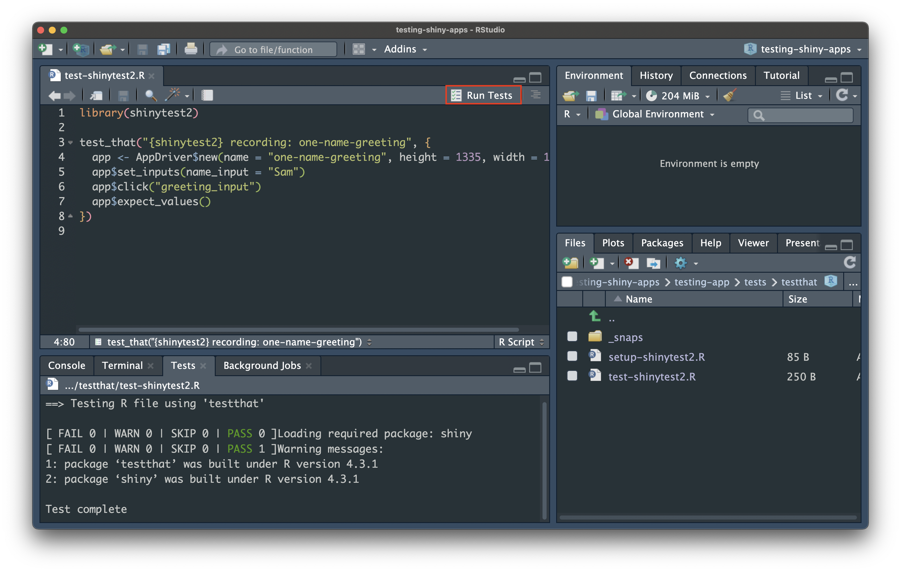
```

---

##  {#test-other-assertions data-menu-title="Test remaining assertions"}

[Test our remaining assertions]{.slide-title}

<hr>

<br>
<br>
<br>

| Action(s)                                                                                       | Expectation(s)                                                           |
|-------------------------------------------------------------------------------------------------|--------------------------------------------------------------------------|
|  Type [some text value] in text box > click Greet button                                          | Greeting output is "Hello [some text value]!"                            |
|  Type [some text value] in text box > click Greet button > type [some other text value] in text box > click Greet button | Greeting output is "Hello [some text value]!", then updates to "Hello [some other text value]!" |
|  Click Greet button                                                                              | Greeting output is "Hello !"                                             |

```{r}
countdown::countdown(
  minutes = 3,
  # left = 0, right = 0,
  # Fanfare when it's over
  # play_sound = TRUE,
  color_border              = "#FFFFFF",
  color_text                = "#7aa81e",
  color_running_background  = "#7aa81e",
  color_running_text        = "#FFFFFF",
  color_finished_background = "#ffa07a",
  color_finished_text       = "#FFFFFF",
  font_size = "2em",
  )
```

---

##  {#feature1-complete-tests data-menu-title="All feature 1 tests"}

[`test-shinytest2.R` should now look like this:]{.slide-title2}

<hr>

[Or at least fairly close to this (maybe you chose different names to test with or had a different viewport size):]{.body-text-s}

```{r filename="~/testing-app/tests/testthat/test-shinytest2.R"}
#| eval: false
#| echo: true
library(shinytest2)

test_that("{shinytest2} recording: one-name-greeting", {
  app <- AppDriver$new(test_path("../.."), name = "one-name-greeting", height = 719, 
      width = 595)
  app$set_inputs(name_input = "Sam")
  app$click("greeting_button_input")
  app$expect_values()
})


test_that("{shinytest2} recording: two-name-greeting", {
  app <- AppDriver$new(test_path("../.."), name = "two-name-greeting", height = 727, 
      width = 501)
  app$set_inputs(name_input = "Sam")
  app$click("greeting_button_input")
  app$expect_values()
  app$set_inputs(name_input = "Carmen")
  app$click("greeting_button_input")
  app$expect_values()
})


test_that("{shinytest2} recording: no-name-greeting", {
  app <- AppDriver$new(test_path("../.."), name = "no-name-greeting", height = 727, 
      width = 501)
  app$click("greeting_button_input")
  app$expect_values()
})
```

::: {.center-text .body-text-s}
You can rerun all your tests at once by clicking the **Run Tests** button again (they should all pass!).
:::

---

##  {#improve-feature1 data-menu-title="Improving feature 1 functionality"}

[Your boss requests an improvement on feature 1]{.slide-title2}

<hr>

[Your boss is excited to see your progress, but would love to see an informative message pop up when a user clicks the Greet button without first typing in a name (currently, clicking the Greet button without typing a name will return "Hello !"... which is a bit odd). You make the following update to your app:]{.body-text-s}

```{r filename="~/testing-app/server.R"}
#| eval: false
#| echo: true
server <- function(input, output) {
  
  # Feature 1 ------------------------------------------------------------------
  
  # observe() automatically re-executes when dependencies change (i.e. when `name_input` is updated), but does not return a result ----
  observe({
    
    # if the user does not type anything before clicking the button, return the message, "Please type a name, then click the Greet button." ----
    if (nchar(input$name_input) == 0) {
      output$greeting_output <- renderText({
        "Please type a name, then click the Greet button."
      })
      
      # if the user does type a name before clicking the button, return the greeting, "Hello [name]!" ----
    } else {
      output$greeting_output <- renderText({
        paste0("Hello ", isolate(input$name_input), "!")
      })
    }
  }) |>
    
    # Execute the above observer once the button is pressed ----
    bindEvent(input$greeting_button_input)
}
```

---

##  {#no-name-greeting-breaks data-menu-title="Your test breaks!"}

[Rerun your tests after making your update]{.slide-title}

<hr>

. . .

Our first tests pass, but **the most recent one failed** . You'll see something like this to start:

```{r}
#| eval: true
#| echo: false
#| fig-align: "center"
#| out-width: "70%"
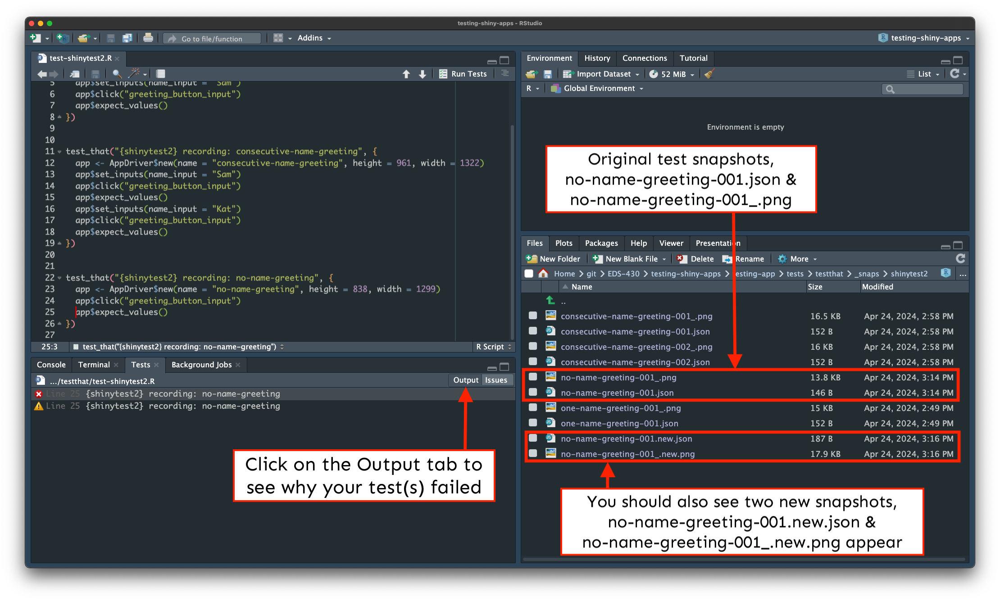
```

::: {.center-text}
Click on the **Output tab** for more information on why the test failed (see next slide).
:::

---

##  {#output-tab data-menu-title="Output tab"}

[The Output tab tells us what caused our test to fail]{.slide-title2}

<hr>

[We see that our `no-name-greeting` test failed and learn what caused that failure:]{.body-text-s}

```{r}
#| eval: false
#| echo: true
#| code-line-numbers: "4,13-23,35-45"
==> Testing R file using 'testthat'

[ FAIL 0 | WARN 1 | SKIP 0 | PASS 0 ]Loading required package: shiny
[ FAIL 1 | WARN 2 | SKIP 0 | PASS 3 ]

── Warning (test-shinytest2.R:1:1): (code run outside of `test_that()`) ────────
package ‘shinytest2’ was built under R version 4.5.2
Backtrace:
    ▆
 1. └─base::library(shinytest2) at test-shinytest2.R:1:1
 2.   └─base (local) testRversion(pkgInfo, package, pkgpath)

── Failure (test-shinytest2.R:28:3): {shinytest2} recording: no-name-greeting ──
Snapshot of `file` has changed.
Differences:
old[4:10] vs new[4:10]
      "name_input": ""
    },
    "output": {
-     "greeting_output": "Hello !"
+     "greeting_output": "Please type a name, then click the Greet button."
    },
    "export": {
  
* Run testthat::snapshot_accept("shinytest2/", "testing-app/tests/testthat") to accept the change.
* Run testthat::snapshot_review("shinytest2/", "testing-app/tests/testthat") to review the change.
Backtrace:
    ▆
 1. └─app$expect_values() at test-shinytest2.R:28:3
 2.   └─shinytest2:::app_expect_values(...)
 3.     └─shinytest2:::app__expect_snapshot_file(...)
 4.       ├─base::withCallingHandlers(...)
 5.       └─testthat::expect_snapshot_file(...)

── Warning (test-shinytest2.R:28:3): {shinytest2} recording: no-name-greeting ──
Diff in snapshot file `shinytest2no-name-greeting-001.json`
< before                                                                   
> after                                                                    
@@ 5,5 / 5,5 @@                                                            
    },                                                                     
    "output": {                                                            
<     "greeting_output": "Hello !"                                         
>     "greeting_output": "Please type a name, then click the Greet button."
    },                                                                     
    "export": {                                                            
[ FAIL 1 | WARN 2 | SKIP 0 | PASS 3 ]
Warning messages:
1: package ‘testthat’ was built under R version 4.5.2 
2: package ‘shiny’ was built under R version 4.5.2 
Test complete
```

---

##  {#update-expectations data-menu-title="Update expected results"}

[We'll want to update our expected results]{.slide-title}

<hr>

[**Our test correctly failed (the expected output was different)!** But we'll want to update our test's expected output so that it reflects the changes we made to our app (i.e. that when a user clicks the Greet button without first typing a name, the text "Please type a name before clicking the Greet button." is printed).]{.body-text-s}

. . .

<br>

[We can use use `testthat::snapshot_review()`, which opens a Shiny app for visually comparing differences (aka *diffs*) between snapshots and accepting (or rejecting) updates.]{.body-text-s}

. . .

<br>

[**Steps:**]{.teal-text .body-text-m}

1. Install the [`{diffviewer}` package](https://github.com/r-lib/diffviewer){target="_blank"}

```{r}
#| eval: false
#| echo: true
#| code-line-numbers: false
install.packages("diffviewer")
```

2. Run the following in your Console to launch the app: 

```{r}
#| eval: false
#| echo: true
#| code-line-numbers: false
testthat::snapshot_review(path = "testing-app/tests/testthat/")
```

::: {.notes}
<https://github.com/r-lib/testthat/blob/f060ccec365e1343ae926c53c215a423b295d7a8/R/snapshot-manage.R#L4>
:::

---

##  {#snapshot-review data-menu-title="snapshot_review()"}

[Explore and accept the updated test expectations]{.slide-title2}

<hr>

The app allows for a few different ways to view snapshot diffs. Click Accept for both the PNG and JSON files, then close the window:

<br>

```{r}
#| eval: true
#| echo: false
#| out-width: "80%"
#| fig-align: "center"
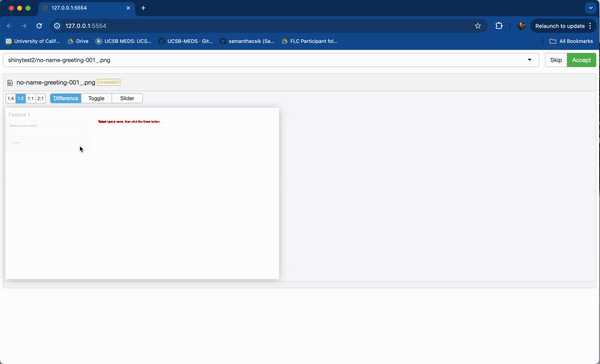
```

---

##  {#updated-snapshots data-menu-title="Updated snapshots"}

[Check out your updated snapshots]{.slide-title2}

<hr>

Check out `no-name-greeting-001_.png` and `no-name-greeting-001.json` snapshots, which should be updated to reflect the new test expectations.

```{r}
#| eval: true
#| echo: false
#| out-width: "80%"
#| fig-align: "center"
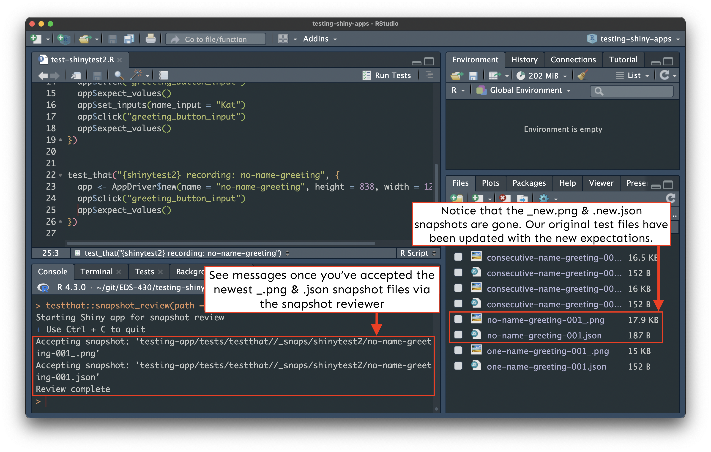
```


---

##  {#feature2-code data-menu-title="Feature 2 code"}

[Your boss requests another feature!]{.slide-title}

<hr>

[Your boss is jazzed about your latest improvements, and now asks you to add a data viz -- a scatterplot of penguin bill depths by bill lengths, with a pickerInput that allows users to filter the data by species. You update your app:]{.body-text-s}

::: {.panel-tabset}
## `global.R`

```{r filename="~/testing-app/global.R"}
#| eval: false
#| echo: true
#| code-line-numbers: "3-5"
# load libraries ----
library(shiny)
library(tidyverse)
library(shinyWidgets)
library(palmerpenguins)
```

## `ui.R`

```{r filename="~/testing-app/ui.R"}
#| eval: false
#| echo: true
#| code-line-numbers: "35-69"
ui <- fluidPage(
  
  # Feature 1 ------------------------------------------------------------------
  
  h1("Feature 1"),
  
  # fluidRow (Feature 1: greeting) ----
  fluidRow(
    
    # greeting sidebarLayout ----
    sidebarLayout(
      
      # greeting sidebarPanel ----
      sidebarPanel(
        
        textInput(inputId = "name_input",
                  label = "What is your name?"),
        
        actionButton(inputId = "greeting_button_input",
                     label = "Greet"),
        
      ), # END greeting sidebarPanel
      
      # greeting mainPanel ----
      mainPanel(
        
        textOutput(outputId = "greeting_output"),
        
      ) # END greeting mainPanel
      
    ) # END greeting sidebarLayout
    
  ), # END fluidRow (Feature 1: greeting)
  
  hr(),
  
  # Feature 2 ------------------------------------------------------------------
  
  h1("Feature 2"),
  
  # fluidRow (Feature 2: plot) -----
  fluidRow(
    
    # plot sidebarLayout ----
    sidebarLayout(
      
      # plot sidebarPanel ----
      sidebarPanel(
        
        # penguin spp pickerInput -----
        pickerInput(inputId = "penguin_spp_input", 
                    label = "Select species:",
                    choices = c("Adelie", "Chinstrap", "Gentoo"),
                    selected = c("Adelie", "Chinstrap", "Gentoo"),
                    multiple = TRUE,
                    options = pickerOptions(actionsBox = TRUE)), # END penguin spp pickerInput
        
      ), # END plot sidebarPanel
      
      # plot mainPanel ----
      mainPanel(
        
        plotOutput(outputId = "scatterplot_output")
        
      ) # END plot mainPanel
      
    ) # END plot sidebarLayout
    
  ) # END fluidRow (Feature 2: plot)
  
) # END fluidPage 
```

## `server.R`

```{r filename="~/testing-app/server.R"}
#| eval: false
#| echo: true
#| code-line-numbers: "25-52"
server <- function(input, output) {
  
  # Feature 1 ------------------------------------------------------------------
  
  # observe() automatically re-executes when dependencies change (i.e. when `name_input` is updated), but does not return a result ----
  observe({
    
    # if the user does not type anything before clicking the button, return the message, "Please type a name, then click the Greet button." ----
    if (nchar(input$name_input) == 0) {
      output$greeting_output <- renderText({
        "Please type a name, then click the Greet button."
      })
      
      # if the user does type a name before clicking the button, return the greeting, "Hello [name]!" ----
    } else {
      output$greeting_output <- renderText({
        paste0("Hello ", isolate(input$name_input), "!")
      })
    }
  }) |>
    
  # Execute the above observer once the button is pressed ----
  bindEvent(input$greeting_button_input)
  
  # Feature 2 ------------------------------------------------------------------
  
  # filter penguin spp (scatterplot) ----
  filtered_spp_scatterplot_df <- reactive({
    
    validate(
      need(length(input$penguin_spp_input) > 0, "Please select at least one penguin species to visualize data for."))
    
    penguins |>
      filter(species %in% input$penguin_spp_input)
    
  })
  
  # render scatterplot ----
  output$scatterplot_output <- renderPlot({
    
    ggplot(na.omit(filtered_spp_scatterplot_df()),
           aes(x = bill_length_mm, y = bill_depth_mm,
               color = species, shape = species)) +
      geom_point() +
      geom_smooth(method = "lm", se = FALSE, aes(color = species)) +
      scale_color_manual(values = c("Adelie" = "darkorange", "Chinstrap" = "purple", "Gentoo" = "cyan4")) +
      scale_shape_manual(values = c("Adelie" = 19, "Chinstrap" = 17, "Gentoo" = 15)) +
      labs(x = "Flipper length (mm)", y = "Bill length (mm)",
           color = "Penguin species", shape = "Penguin species") +
      theme(legend.position = "bottom")
    
  })
  
}
```

:::

---

##  {#run-ft2-app data-menu-title="Run the app"}

[Run your app & play around with the new feature]{.slide-title2}

<hr>

Try out the pickerInput and identify different actions / scenarios that a user may encounter which you’d like to write tests for.

```{r}
#| eval: true
#| echo: false
#| fig-align: "center"
#| out-width: "100%"
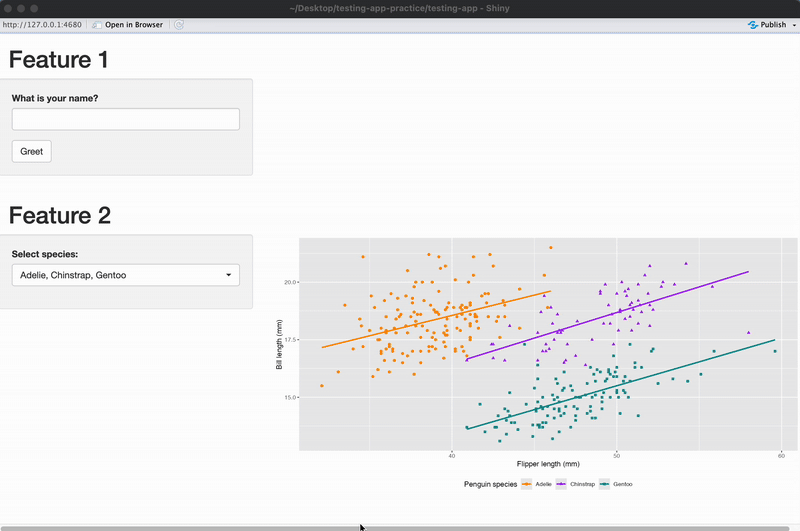
```

<br>

::: {.center-text}
Your boss gives you the green light to start writing tests.
:::

---

##  {#ft2-assertions data-menu-title="Feature 2 assertions"}

[Begin by jotting down some assertions]{.slide-title3}

<hr>

Chat with the person(s) next to you and try to come up with a few different actions / scenarios a user may encounter with Feature 2. You *do not* need to describe every single possible scenario, but ensure that they are varied and represent different user interactions.

```{r}
countdown::countdown(
  minutes = 3,
  # left = 0, right = 0,
  # Fanfare when it's over
  # play_sound = TRUE,
  color_border              = "#FFFFFF",
  color_text                = "#7aa81e",
  color_running_background  = "#7aa81e",
  color_running_text        = "#FFFFFF",
  color_finished_background = "#ffa07a",
  color_finished_text       = "#FFFFFF",
  font_size = "2em",
  )
```

<br>

. . . 

| Action(s)                                             | Expectation(s)                                                                                                                                                                                               |
|-------------------------------------------------------|--------------------------------------------------------------------------------------------------------------------------------------------------------------------------------------------------------------|
| Select all 3 species (no action / default state)      | A scatterplot with all three species' data is rendered                                                                                                                                                       |
| Deselect Adelie                                       | A scatterplot with just Gentoo & Chinstrap data is rendered                                                                                                                                                  |
| Click Deselect All > Select Gentoo > Click Select All | An error message, "Please select at least one penguin species to visualize data for." is returned > A scatterplot with just Gentoo data is rendered > A scatterplot with all three species' data is rendered |


<!-- --- -->

<!-- ##  {#create-test-data data-menu-title="Create test data"} -->

<!-- [We'll also need some test data]{.slide-title} -->

<!-- <hr> -->

<!-- We'll need CSVs which can be used as representative examples for each of the scenarios we want to test for. This includes:  -->

<!-- - [two different CSVs, each with correct column headers / data]{.body-text-s} -->
<!-- - [one CSV with incorrect column headers]{.body-text-s}  -->
<!-- - [one completely blank CSV]{.body-text-s} -->
<!-- - [one CSV with column headers but missing data]{.body-text-s} -->
<!-- - [one CSV with data but missing column headers]{.body-text-s} -->

<!-- <br> -->

<!-- The test data do not necessarily need to be "real" (i.e. real measurements collected by instruments or people). They can be simple, short data sets, so long as they cover the scenarios we've discussed. -->

<!-- <br> -->

<!-- ::: {.center-text .body-text-m} -->
<!-- **Download these test data [CSV files](https://drive.google.com/drive/folders/14VIirofAz04KwTyHqQ_8pbOK95IqUQ1H?usp=drive_link)**, which we'll use to create our tests (you can save them to your Desktop for now). -->
<!-- ::: -->

<!-- --- -->

<!-- ##  {#storing-test-data data-menu-title="Storing test data"} -->

<!-- [Store test data in `tests/testthat/`]{.slide-title} -->

<!-- <hr> -->

<!-- <br> -->

<!-- Whenever you record a file upload event to a `fileInput`, the test script will include a line similar to this, -->

<!-- <br> -->

<!-- ```{r} -->
<!-- #| eval: false -->
<!-- #| echo: true -->
<!-- #| code-line-numbers: false -->
<!-- app$uploadFile(file1 = "your-data.csv") -->
<!-- ``` -->

<!-- <br> -->

<!-- which indicates the file name, but not the file path. `{shinytest2}` will look for a test file with that name inside the `tests/testthat/` folder. -->

<!-- <br> -->

<!-- ::: {.center-text .body-text-m} -->
<!-- **Make *copies* of all of the test files into `tests/testthat/`.** -->
<!-- ::: -->

---

##  {#ft2-test1 data-menu-title="Feature 2, test 1"}

[Okay, let's write our first test for feature 2!]{.slide-title2}

<hr>

<br>

[**Repeat the steps from earlier:**]{.body-text-m .teal-text}

[[**(1)**]{.teal-text} Run `shinytest2::record_test("testing-app")` in the Console]{.body-text-s}

[[**(2)**]{.teal-text} Click Expect Shiny Values (to capture the default state, i.e. all three species selected by default)]{.body-text-s}

[[**(3)**]{.teal-text} Give the test a unique name (e.g. `default-three-spp`) > click Save test and exit]{.body-text-s}

[[**(4)**]{.teal-text} The test recorder will quit, and your test will automatically execute]{.body-text-s}

<br>

. . .

[What happens?]{.body-text-l}


<br>

. . . 

[All of our feature 1 tests failed??? What???]{.body-text-l}

---

##  {#old-tests-fail data-menu-title="Old tests fail"}

[Explore the diffs in your Console]{.slide-title2}

<hr>

Your console should look similar to this:

```{r}
#| eval: false
#| echo: true
Listening on http://127.0.0.1:4680
{shiny} R stderr ----------- Loading required package: shiny
{shiny} R stderr ----------- Warning: package ‘shiny’ was built under R version 4.3.1
{shiny} R stderr ----------- Running application in test mode.
{shiny} R stderr ----------- Warning: package ‘ggplot2’ was built under R version 4.3.1
{shiny} R stderr ----------- Warning: package ‘readr’ was built under R version 4.3.1
{shiny} R stderr ----------- Warning: package ‘dplyr’ was built under R version 4.3.1
{shiny} R stderr ----------- Warning: package ‘stringr’ was built under R version 4.3.1
{shiny} R stderr ----------- Warning: package ‘shinyWidgets’ was built under R version 4.3.1
{shiny} R stderr ----------- 
{shiny} R stderr ----------- Listening on http://127.0.0.1:6652
{shiny} R stderr ----------- `geom_smooth()` using formula = 'y ~ x'
{shiny} R stdout ----------- ── Attaching core tidyverse packages ──────────────────────── tidyverse 2.0.0 ──
{shiny} R stdout ----------- ✔ dplyr     1.1.4     ✔ readr     2.1.5
{shiny} R stdout ----------- ✔ forcats   1.0.0     ✔ stringr   1.5.1
{shiny} R stdout ----------- ✔ ggplot2   3.5.0     ✔ tibble    3.2.1
{shiny} R stdout ----------- ✔ lubridate 1.9.2     ✔ tidyr     1.3.0
{shiny} R stdout ----------- ✔ purrr     1.0.2     
{shiny} R stdout ----------- ── Conflicts ────────────────────────────────────────── tidyverse_conflicts() ──
{shiny} R stdout ----------- ✖ dplyr::filter() masks stats::filter()
{shiny} R stdout ----------- ✖ dplyr::lag()    masks stats::lag()
{shiny} R stdout ----------- ℹ Use the conflicted package (<http://conflicted.r-lib.org/>) to force all conflicts to become errors
{shiny} R stderr ----------- `geom_smooth()` using formula = 'y ~ x'
• Saving test file: tests/testthat/test-shinytest2.R
• Modify '/Users/samanthacsik/Desktop/testing-app-practice/testing-app/tests/testthat/test-shinytest2.R'
• Running recorded test: tests/testthat/test-shinytest2.R
✔ | F W  S  OK | Context
✖ | 4 6      1 | shinytest2 [10.0s]                                                                                     
────────────────────────────────────────────────────────────────────────────────────────────────────────────────────────
Failure (test-shinytest2.R:7:3): {shinytest2} recording: one-name-greeting
Snapshot of `file` to 'shinytest2/one-name-greeting-001.json' has changed
Run testthat::snapshot_review('shinytest2/') to review changes
Backtrace:
    ▆
 1. └─app$expect_values() at test-shinytest2.R:7:3
 2.   └─shinytest2:::app_expect_values(...)
 3.     └─shinytest2:::app__expect_snapshot_file(...)
 4.       ├─base::withCallingHandlers(...)
 5.       └─testthat::expect_snapshot_file(...)

Warning (test-shinytest2.R:7:3): {shinytest2} recording: one-name-greeting
Diff in snapshot file `shinytest2one-name-greeting-001.json`
< before                                                             
> after                                                              
@@ 2,9 / 2,58 @@                                                     
    "input": {                                                       
      "greeting_button_input": 1,                                    
<     "name_input": "Sam"                                            
>     "name_input": "Sam",                                           
>     "penguin_spp_input": [                                         
>       "Adelie",                                                    
>       "Chinstrap",                                                 
>       "Gentoo"                                                     
>     ]                                                              
    },                                                               
    "output": {                                                      
<     "greeting_output": "Hello Sam!"                                
>     "greeting_output": "Hello Sam!",                               
>     "scatterplot_output": {                                        
>       "src": "[image data hash: 728c0875df36ff065ee4688ef08088ac]",
>       "width": 841.328125,                                         
>       "height": 400,                                               
>       "alt": "Plot object",                                        
>       "coordmap": {                                                
>         "panels": [                                                
>           {                                                        
>             "panel": 1,                                            
>             "row": 1,                                              
>             "col": 1,                                              
>             "panel_vars": {                                        
>                                                                    
>             },                                                     
>             "log": {                                               
>               "x": null,                                           
>               "y": null                                            
    },                                                               
>             "domain": {                                            
>               "left": 30.725,                                      
>               "right": 60.975,                                     
>               "bottom": 12.68,                                     
>               "top": 21.92                                         
>             },                                                     
>             "mapping": {                                           
>               "x": "bill_length_mm",                               
>               "y": "bill_depth_mm",                                
>               "colour": "species",                                 
>               "shape": "species"                                   
>             },                                                     
>             "range": {                                             
>               "left": 40.26005993150689,                           
>               "right": 835.5205479452055,                          
>               "bottom": 329.6486649310203,                         
>               "top": 5.479452054794522                             
>             }                                                      
>           }                                                        
>         ],                                                         
>         "dims": {                                                  
>           "width": 841.328125,                                     
>           "height": 400                                            
>         }                                                          
>       }                                                            
>     }                                                              
>   },                                                               
    "export": {                                                      
                                                                     

Failure (test-shinytest2.R:15:3): {shinytest2} recording: consecutive-name-greeting
Snapshot of `file` to 'shinytest2/consecutive-name-greeting-001.json' has changed
Run testthat::snapshot_review('shinytest2/') to review changes
Backtrace:
    ▆
 1. └─app$expect_values() at test-shinytest2.R:15:3
 2.   └─shinytest2:::app_expect_values(...)
 3.     └─shinytest2:::app__expect_snapshot_file(...)
 4.       ├─base::withCallingHandlers(...)
 5.       └─testthat::expect_snapshot_file(...)

Warning (test-shinytest2.R:15:3): {shinytest2} recording: consecutive-name-greeting
Diff in snapshot file `shinytest2consecutive-name-greeting-001.json`
< before                                                             
> after                                                              
@@ 2,9 / 2,58 @@                                                     
    "input": {                                                       
      "greeting_button_input": 1,                                    
<     "name_input": "Sam"                                            
>     "name_input": "Sam",                                           
>     "penguin_spp_input": [                                         
>       "Adelie",                                                    
>       "Chinstrap",                                                 
>       "Gentoo"                                                     
>     ]                                                              
    },                                                               
    "output": {                                                      
<     "greeting_output": "Hello Sam!"                                
>     "greeting_output": "Hello Sam!",                               
>     "scatterplot_output": {                                        
>       "src": "[image data hash: 728c0875df36ff065ee4688ef08088ac]",
>       "width": 841.328125,                                         
>       "height": 400,                                               
>       "alt": "Plot object",                                        
>       "coordmap": {                                                
>         "panels": [                                                
>           {                                                        
>             "panel": 1,                                            
>             "row": 1,                                              
>             "col": 1,                                              
>             "panel_vars": {                                        
>                                                                    
>             },                                                     
>             "log": {                                               
>               "x": null,                                           
>               "y": null                                            
    },                                                               
>             "domain": {                                            
>               "left": 30.725,                                      
>               "right": 60.975,                                     
>               "bottom": 12.68,                                     
>               "top": 21.92                                         
>             },                                                     
>             "mapping": {                                           
>               "x": "bill_length_mm",                               
>               "y": "bill_depth_mm",                                
>               "colour": "species",                                 
>               "shape": "species"                                   
>             },                                                     
>             "range": {                                             
>               "left": 40.26005993150689,                           
>               "right": 835.5205479452055,                          
>               "bottom": 329.6486649310203,                         
>               "top": 5.479452054794522                             
>             }                                                      
>           }                                                        
>         ],                                                         
>         "dims": {                                                  
>           "width": 841.328125,                                     
>           "height": 400                                            
>         }                                                          
>       }                                                            
>     }                                                              
>   },                                                               
    "export": {                                                      
                                                                     

Failure (test-shinytest2.R:18:3): {shinytest2} recording: consecutive-name-greeting
Snapshot of `file` to 'shinytest2/consecutive-name-greeting-002.json' has changed
Run testthat::snapshot_review('shinytest2/') to review changes
Backtrace:
    ▆
 1. └─app$expect_values() at test-shinytest2.R:18:3
 2.   └─shinytest2:::app_expect_values(...)
 3.     └─shinytest2:::app__expect_snapshot_file(...)
 4.       ├─base::withCallingHandlers(...)
 5.       └─testthat::expect_snapshot_file(...)

Warning (test-shinytest2.R:18:3): {shinytest2} recording: consecutive-name-greeting
Diff in snapshot file `shinytest2consecutive-name-greeting-002.json`
< before                                                             
> after                                                              
@@ 2,9 / 2,58 @@                                                     
    "input": {                                                       
      "greeting_button_input": 2,                                    
<     "name_input": "Kat"                                            
>     "name_input": "Kat",                                           
>     "penguin_spp_input": [                                         
>       "Adelie",                                                    
>       "Chinstrap",                                                 
>       "Gentoo"                                                     
>     ]                                                              
    },                                                               
    "output": {                                                      
<     "greeting_output": "Hello Kat!"                                
>     "greeting_output": "Hello Kat!",                               
>     "scatterplot_output": {                                        
>       "src": "[image data hash: 728c0875df36ff065ee4688ef08088ac]",
>       "width": 841.328125,                                         
>       "height": 400,                                               
>       "alt": "Plot object",                                        
>       "coordmap": {                                                
>         "panels": [                                                
>           {                                                        
>             "panel": 1,                                            
>             "row": 1,                                              
>             "col": 1,                                              
>             "panel_vars": {                                        
>                                                                    
>             },                                                     
>             "log": {                                               
>               "x": null,                                           
>               "y": null                                            
    },                                                               
>             "domain": {                                            
>               "left": 30.725,                                      
>               "right": 60.975,                                     
>               "bottom": 12.68,                                     
>               "top": 21.92                                         
>             },                                                     
>             "mapping": {                                           
>               "x": "bill_length_mm",                               
>               "y": "bill_depth_mm",                                
>               "colour": "species",                                 
>               "shape": "species"                                   
>             },                                                     
>             "range": {                                             
>               "left": 40.26005993150689,                           
>               "right": 835.5205479452055,                          
>               "bottom": 329.6486649310203,                         
>               "top": 5.479452054794522                             
>             }                                                      
>           }                                                        
>         ],                                                         
>         "dims": {                                                  
>           "width": 841.328125,                                     
>           "height": 400                                            
>         }                                                          
>       }                                                            
>     }                                                              
>   },                                                               
    "export": {                                                      
                                                                     

Failure (test-shinytest2.R:25:3): {shinytest2} recording: no-name-greeting
Snapshot of `file` to 'shinytest2/no-name-greeting-001.json' has changed
Run testthat::snapshot_review('shinytest2/') to review changes
Backtrace:
    ▆
 1. └─app$expect_values() at test-shinytest2.R:25:3
 2.   └─shinytest2:::app_expect_values(...)
 3.     └─shinytest2:::app__expect_snapshot_file(...)
 4.       ├─base::withCallingHandlers(...)
 5.       └─testthat::expect_snapshot_file(...)

Warning (test-shinytest2.R:25:3): {shinytest2} recording: no-name-greeting
Diff in snapshot file `shinytest2no-name-greeting-001.json`
< before                                                                    
> after                                                                     
@@ 2,9 / 2,58 @@                                                            
    "input": {                                                              
      "greeting_button_input": 1,                                           
<     "name_input": ""                                                      
>     "name_input": "",                                                     
>     "penguin_spp_input": [                                                
>       "Adelie",                                                           
>       "Chinstrap",                                                        
>       "Gentoo"                                                            
>     ]                                                                     
    },                                                                      
    "output": {                                                             
<     "greeting_output": "Please type a name, then click the Greet button." 
>     "greeting_output": "Please type a name, then click the Greet button.",
>     "scatterplot_output": {                                               
>       "src": "[image data hash: 728c0875df36ff065ee4688ef08088ac]",       
>       "width": 841.328125,                                                
>       "height": 400,                                                      
>       "alt": "Plot object",                                               
>       "coordmap": {                                                       
>         "panels": [                                                       
>           {                                                               
>             "panel": 1,                                                   
>             "row": 1,                                                     
>             "col": 1,                                                     
>             "panel_vars": {                                               
>                                                                           
>             },                                                            
>             "log": {                                                      
>               "x": null,                                                  
>               "y": null                                                   
    },                                                                      
>             "domain": {                                                   
>               "left": 30.725,                                             
>               "right": 60.975,                                            
>               "bottom": 12.68,                                            
>               "top": 21.92                                                
>             },                                                            
>             "mapping": {                                                  
>               "x": "bill_length_mm",                                      
>               "y": "bill_depth_mm",                                       
>               "colour": "species",                                        
>               "shape": "species"                                          
>             },                                                            
>             "range": {                                                    
>               "left": 40.26005993150689,                                  
>               "right": 835.5205479452055,                                 
>               "bottom": 329.6486649310203,                                
>               "top": 5.479452054794522                                    
>             }                                                             
>           }                                                               
>         ],                                                                
>         "dims": {                                                         
>           "width": 841.328125,                                            
>           "height": 400                                                   
>         }                                                                 
>       }                                                                   
>     }                                                                     
>   },                                                                      
    "export": {                                                             
                                                                            

Warning (test-shinytest2.R:31:3): {shinytest2} recording: default-three-spp
Adding new file snapshot: 'tests/testthat/_snaps/default-three-spp-001_.png'

Warning (test-shinytest2.R:31:3): {shinytest2} recording: default-three-spp
Adding new file snapshot: 'tests/testthat/_snaps/default-three-spp-001.json'
────────────────────────────────────────────────────────────────────────────────────────────────────────────────────────

══ Results ═════════════════════════════════════════════════════════════════════════════════════════════════════════════
Duration: 10.5 s

── Failed tests ────────────────────────────────────────────────────────────────────────────────────────────────────────
Failure (test-shinytest2.R:7:3): {shinytest2} recording: one-name-greeting
Snapshot of `file` to 'shinytest2/one-name-greeting-001.json' has changed
Run testthat::snapshot_review('shinytest2/') to review changes
Backtrace:
    ▆
 1. └─app$expect_values() at test-shinytest2.R:7:3
 2.   └─shinytest2:::app_expect_values(...)
 3.     └─shinytest2:::app__expect_snapshot_file(...)
 4.       ├─base::withCallingHandlers(...)
 5.       └─testthat::expect_snapshot_file(...)

Failure (test-shinytest2.R:15:3): {shinytest2} recording: consecutive-name-greeting
Snapshot of `file` to 'shinytest2/consecutive-name-greeting-001.json' has changed
Run testthat::snapshot_review('shinytest2/') to review changes
Backtrace:
    ▆
 1. └─app$expect_values() at test-shinytest2.R:15:3
 2.   └─shinytest2:::app_expect_values(...)
 3.     └─shinytest2:::app__expect_snapshot_file(...)
 4.       ├─base::withCallingHandlers(...)
 5.       └─testthat::expect_snapshot_file(...)

Failure (test-shinytest2.R:18:3): {shinytest2} recording: consecutive-name-greeting
Snapshot of `file` to 'shinytest2/consecutive-name-greeting-002.json' has changed
Run testthat::snapshot_review('shinytest2/') to review changes
Backtrace:
    ▆
 1. └─app$expect_values() at test-shinytest2.R:18:3
 2.   └─shinytest2:::app_expect_values(...)
 3.     └─shinytest2:::app__expect_snapshot_file(...)
 4.       ├─base::withCallingHandlers(...)
 5.       └─testthat::expect_snapshot_file(...)

Failure (test-shinytest2.R:25:3): {shinytest2} recording: no-name-greeting
Snapshot of `file` to 'shinytest2/no-name-greeting-001.json' has changed
Run testthat::snapshot_review('shinytest2/') to review changes
Backtrace:
    ▆
 1. └─app$expect_values() at test-shinytest2.R:25:3
 2.   └─shinytest2:::app_expect_values(...)
 3.     └─shinytest2:::app__expect_snapshot_file(...)
 4.       ├─base::withCallingHandlers(...)
 5.       └─testthat::expect_snapshot_file(...)

[ FAIL 4 | WARN 6 | SKIP 0 | PASS 1 ]

Don't worry, you'll get it.
Error: Test failures
```

---

##  {#why-fail data-menu-title="Why did old tests fail?"}

[Why did the old tests fail?]{.slide-title}

<hr>

<br>

::: {.center-text .body-text-m}
*What do you notice about each of the failed tests?*
:::

<br>

:::: {.columns}
::: {.column width="50%"}
For an easier time comparing diffs for each snapshot, open the snapshot reviewer (run in the Console): 

<br>

```{r}
#| eval: false
#| echo: true
#| code-line-numbers: false
testthat::snapshot_review(path = "testing-app/tests/testthat/")
```

<br>

::: {.body-text-s}
Use the drop down to switch between snapshots. Don't Accept any updates just yet.
:::
:::

::: {.column width="50%"}
```{r}
#| eval: true
#| echo: false
#| fig-align: "center"
#| out-width: "100%"
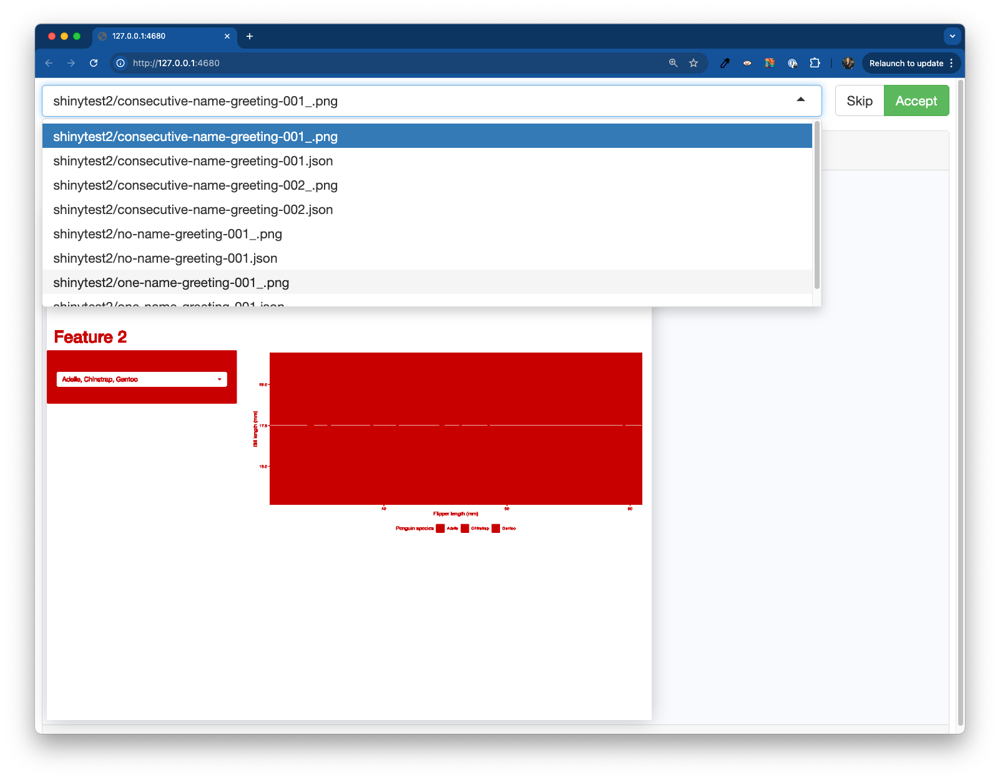
```
:::
::::

---

##  {#scope-too-large1 data-menu-title="Scope too large 1"}

[The scope of our assertions was too large]{.slide-title}

<hr>

**The scope of our test assertions was too large to isolate the behavior that we were looking to test.**

. . .

[Let's look at our `one-name-greeting-001_.png` snapshot as an example to better understand why our first four tests of feature 1 (greeting) failed:]{.body-text-s}

:::: {.columns}
::: {.column width="50%"}
```{r}
#| eval: true
#| echo: false
#| out-width: "100%"
#| fig-align: "center"
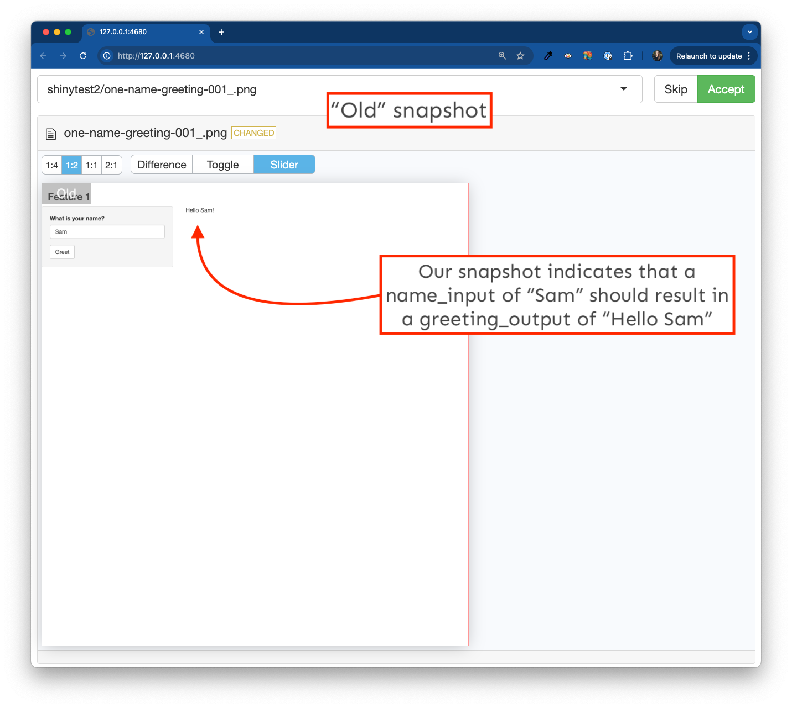
```
:::
::: {.column width="50%"}
```{r}
#| eval: true
#| echo: false
#| out-width: "100%"
#| fig-align: "center"
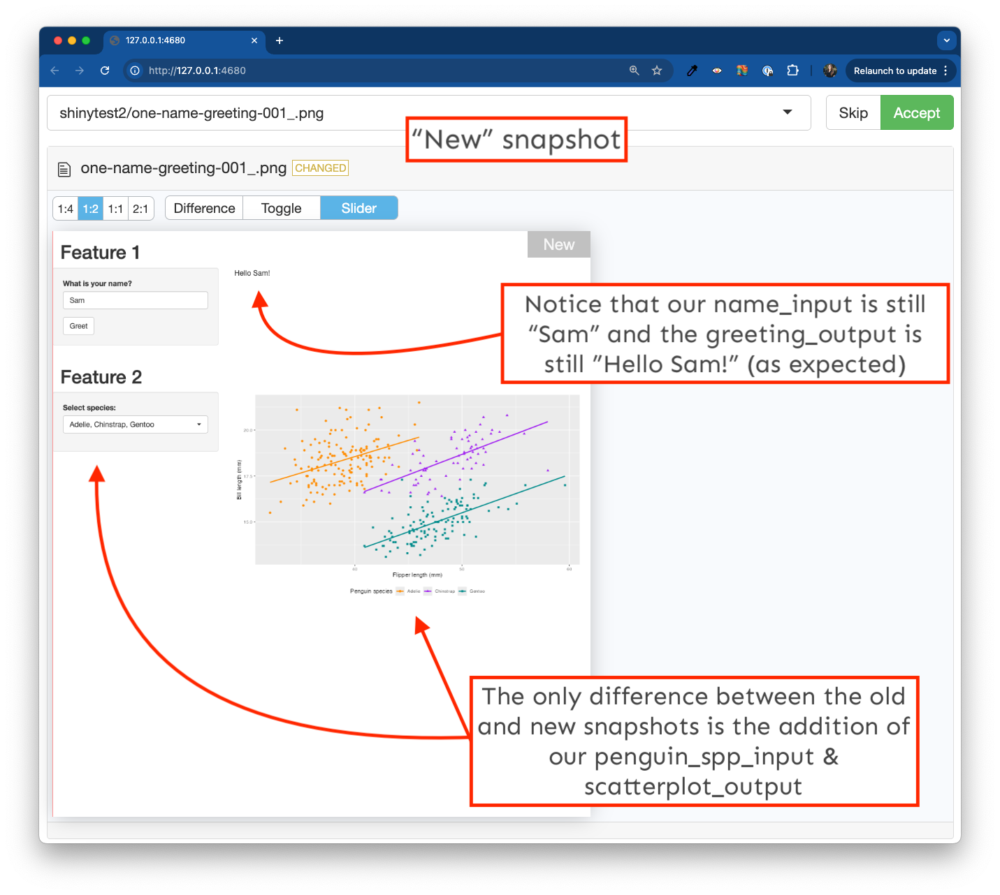
```
:::
::::

---

##  {#scope-too-large2 data-menu-title="Scope too large 2"}

[The scope of our assertions was too large]{.slide-title}

<hr>

**The scope of our test assertions was too large to isolate the behavior that we were looking to test.**

[Our `one-name-greeting-001.json` file provides an alternative view.]{.body-text-s}

```{r}
#| eval: true
#| echo: false
#| out-width: "100%"
#| fig-align: "center"
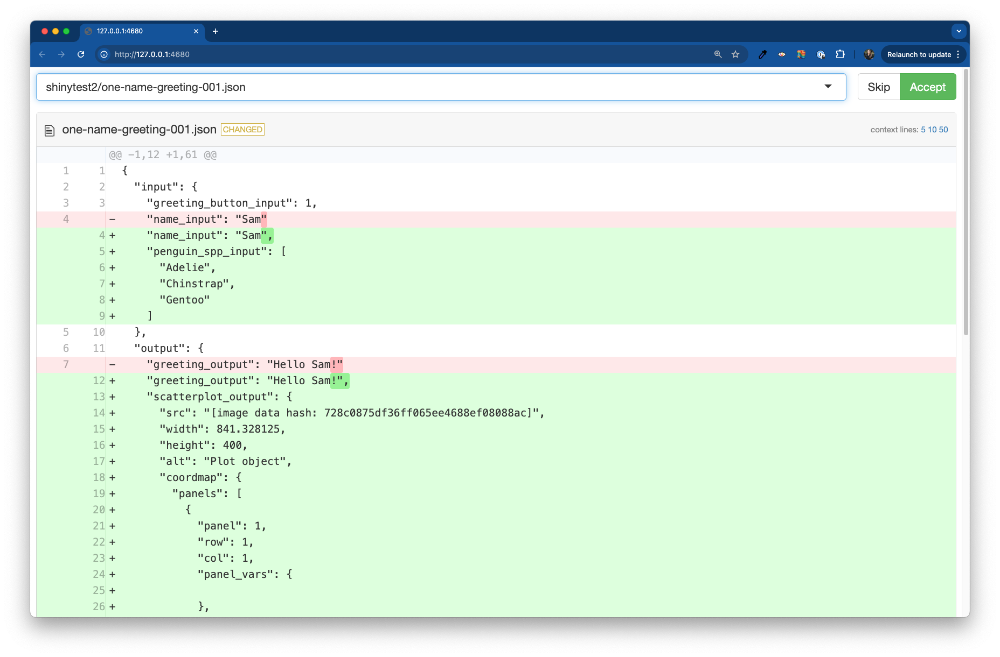
```

---

##  {#scope-too-large3 data-menu-title="Scope too large 3"}

[The scope of our assertions was too large]{.slide-title}

<hr>

<br>

::: {.center-text}
**Our test failed, despite the behavior of our test subject *not* changing** (in other words, our test failed, even though the expected output, "Hello Sam!" stayed the same.)
:::

. . . 

<br>

::: {.center-text}
A good test is able to isolate the behavior of it's subject so that you can trust the result of the test. In this case, our tests failed when they shouldn't have...
:::

<br>

. . . 

::: {.center-text}
Therefore, **we need to modify our tests so that they capture a *targeted value expectation*, rather than the state of our entire application**. For example:
:::

:::: {.columns}
::: {.column width="50%"}

::: {.center-text .gray-text .body-text-s}
Non-targeted value expectation
:::

```{r}
#| eval: false
#| echo: true
#| code-line-numbers: "5"
test_that("{shinytest2} recording: one-name-greeting", {
  app <- AppDriver$new(name = "one-name-greeting", height = 815, width = 1276)
  app$set_inputs(name_input = "Sam")
  app$click("greeting_button_input")
  app$expect_values()
})
```
:::
::: {.column width="50%"}

::: {.center-text .gray-text .body-text-s}
Targeted value expectation
:::

```{r}
#| eval: false
#| echo: true
#| code-line-numbers: "5"
test_that("{shinytest2} recording: one-name-greeting", {
  app <- AppDriver$new(name = "one-name-greeting", height = 815, width = 1276)
  app$set_inputs(name_input = "Sam")
  app$click("greeting_button_input")
  app$expect_values(output = "greeting_output")
})
```
:::
::::

---

##  {#targeted-expectations data-menu-title="Targetted expectations"}

[Update tests so that they make *targeted* value expectations]{.slide-title3}

<hr>

```{r filename="~/testing-app/tests/testthat/test-shinytest2.R"}
#| eval: false
#| echo: true
#| code-line-numbers: "7,15,18,25,31"
library(shinytest2)

test_that("{shinytest2} recording: one-name-greeting", {
  app <- AppDriver$new(test_path("../.."), name = "one-name-greeting", height = 1097, width = 1277)
  app$set_inputs(name_input = "Sam")
  app$click("greeting_button_input")
  app$expect_values(output = "greeting_output")
})


test_that("{shinytest2} recording: consecutive-name-greeting", {
  app <- AppDriver$new(test_path("../.."), name = "consecutive-name-greeting", height = 1112, width = 1277)
  app$set_inputs(name_input = "Sam")
  app$click("greeting_button_input")
  app$expect_values(output = "greeting_output")
  app$set_inputs(name_input = "Kat")
  app$click("greeting_button_input")
  app$expect_values(output = "greeting_output")
})


test_that("{shinytest2} recording: no-name-greeting", {
  app <- AppDriver$new(test_path("../.."), name = "no-name-greeting", height = 1097, width = 1277)
  app$click("greeting_button_input")
  app$expect_values(output = "greeting_output")
})


test_that("{shinytest2} recording: default-three-spp", {
  app <- AppDriver$new(test_path("../.."), name = "default-three-spp", height = 1099, width = 1209)
  app$expect_values(output = "scatterplot_output")
})
```

---

##  {#updated-tests-fail data-menu-title="Updated test fail"}

[Our updated tests all failed]{.slide-title}

<hr>

<br>
<br>
<br>


After updating your tests, click **Run Tests**. They all should fail. You can check out the Tests > Output tab to explore the diffs, or launch the snapshot reviewer:

<br>

```{r}
#| eval: false
#| echo: true
#| code-line-numbers: false
testthat::snapshot_review(path = "testing-app/tests/testthat/")
```

<br>


::: {.center-text .body-text-m}
What do you notice about the diffs?
:::

---

##  {#specified-output data-menu-title="Specified output"}

[Targeted value expectations snapshot a specified `output`(s) . . .]{.slide-title3}

<hr>

...as opposed to the default, which is to snapshot the entire application. **This is what we want!**

<br>

```{r}
#| eval: true
#| echo: false
#| fig-align: "center"
#| out-width: "100%"
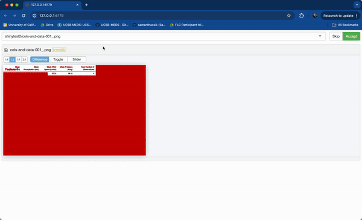
```

::: {.center-text}
**Accept all new snapshots** -- all tests should now pass when you rerun your test file.
:::

---

##  {#control-click data-menu-title="Control/command click targets"}

[Make a targeted value expectation using the test recorder]{.slide-title3}

<hr>

[Let's write a test that makes a targeted value expectation for our second assertion of feature 2 (copied below from our [original table](#ft2-assertions){target="_blank"}):]{.body-text-s}

- [**Action(s):** Deselect Adelie]{.body-text-s}
- [**Expectation:** A scatterplot with just Gentoo & Chinstrap data rendered]{.body-text-s}

:::: {.columns}
::: {.column width="50%"}

<br>

```{r}
#| eval: true
#| echo: false
#| fig-align: "center"
#| out-width: "100%"
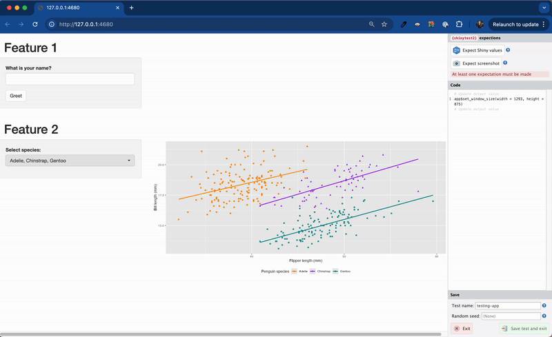
```
:::

::: {.column width="50%"}
[**Steps:**]{.teal-text}

[[**(1)**]{.teal-text} Run `shinytest2::record_test("testing-app")` in the Console]{.body-text-s}

[[**(2**]{.teal-text} Click on the `pickerInput` and deselect Adelie]{.body-text-s}

[[**(3)**]{.teal-text} Hold down the `cmd`/`ctrl` button on your keyboard, then click on the **output** -- for us, that's the updated plot that displays just Gentoo & Chinstrap data]{.body-text-s}

[[**(4)**]{.teal-text} Give the test a unique name (e.g. `deselect-adelie`) > click Save test and exit (tests should automatically execute and pass!)]{.body-text-s}
:::
::::

::: {.footer}
IMPORTANT: You'll likely encounter a popup each time you click on the `pickerInput`. **Be sure to click *Record*.** Read more about [input bindings](https://rstudio.github.io/shinytest2/articles/in-depth.html?q=input%20binding#inputs-without-input-bindings){target="_blank"}.
:::

<!-- --- -->

<!-- ::: {.center-text} -->
<!-- *NOTE: You'll likely encounter this popup each time you click on the `pickerInput` -- click **Record**:* -->
<!-- ::: -->

<!-- ```{r} -->
<!-- #| eval: true -->
<!-- #| echo: false -->
<!-- #| out-width: "30%" -->
<!-- #| fig-align: "center" -->
<!-- 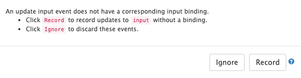 -->
<!-- ``` -->

<!-- ::: {.footer} -->
<!-- Read more about [input bindings](https://rstudio.github.io/shinytest2/articles/in-depth.html?q=input%20binding#inputs-without-input-bindings) in the `{shinytest2}` documentation. -->
<!-- ::: -->

---

##  {#write-all-ft2-tests data-menu-title="Write remaining feature 2 tests"}

[Write a test for the final feature 2 assertion]{.slide-title}

<hr>

[See the [original table](#ft2-assertions){target="_blank"} for a reminder of our defined action and expectation. When complete, your updated `test-shinytest2.R` file should look similar to this (and all tests should pass!):]{.body-text-s}

```{r filename="~/testing-app/tests/testthat/test-shinytest2.R"}
#| eval: false
#| echo: true
library(shinytest2)

test_that("{shinytest2} recording: one-name-greeting", {
  app <- AppDriver$new(test_path("../.."), name = "one-name-greeting", height = 1097, width = 1277)
  app$set_inputs(name_input = "Sam")
  app$click("greeting_button_input")
  app$expect_values(output = "greeting_output")
})


test_that("{shinytest2} recording: consecutive-name-greeting", {
  app <- AppDriver$new(test_path("../.."), name = "consecutive-name-greeting", height = 1112, width = 1277)
  app$set_inputs(name_input = "Sam")
  app$click("greeting_button_input")
  app$expect_values(output = "greeting_output")
  app$set_inputs(name_input = "Kat")
  app$click("greeting_button_input")
  app$expect_values(output = "greeting_output")
})


test_that("{shinytest2} recording: no-name-greeting", {
  app <- AppDriver$new(test_path("../.."), name = "no-name-greeting", height = 1097, width = 1277)
  app$click("greeting_button_input")
  app$expect_values(output = "greeting_output")
})


test_that("{shinytest2} recording: default-three-spp", {
  app <- AppDriver$new(test_path("../.."), name = "default-three-spp", height = 1099, width = 1209)
  app$expect_values(output = "scatterplot_output")
})


test_that("{shinytest2} recording: deselect-adelie", {
  app <- AppDriver$new(test_path("../.."), name = "deselect-adelie", height = 875, width = 1293)
  app$set_inputs(penguin_spp_input_open = TRUE, allow_no_input_binding_ = TRUE)
  app$set_inputs(penguin_spp_input = c("Chinstrap", "Gentoo"))
  app$expect_values(output = "scatterplot_output")
  app$set_inputs(penguin_spp_input_open = FALSE, allow_no_input_binding_ = TRUE)
})


test_that("{shinytest2} recording: consecutive-spp-selections", {
  app <- AppDriver$new(test_path("../.."), name = "consecutive-spp-selections", height = 875, width = 1292)
  app$set_inputs(penguin_spp_input_open = TRUE, allow_no_input_binding_ = TRUE)
  app$set_inputs(penguin_spp_input = character(0))
  app$expect_values(output = "scatterplot_output")
  app$set_inputs(penguin_spp_input_open = FALSE, allow_no_input_binding_ = TRUE)
  app$set_inputs(penguin_spp_input_open = TRUE, allow_no_input_binding_ = TRUE)
  app$set_inputs(penguin_spp_input = "Gentoo")
  app$expect_values(output = "scatterplot_output")
  app$set_inputs(penguin_spp_input_open = FALSE, allow_no_input_binding_ = TRUE)
  app$set_inputs(penguin_spp_input_open = TRUE, allow_no_input_binding_ = TRUE)
  app$set_inputs(penguin_spp_input = c("Adelie", "Chinstrap", "Gentoo"))
  app$expect_values(output = "scatterplot_output")
  app$set_inputs(penguin_spp_input_open = FALSE, allow_no_input_binding_ = TRUE)
})
```

---

##  {#refactor-code data-menu-title="refactor-code"}

[What if we decide to refactor our code?]{.slide-title}

<hr>

[Let's say we want to extract our `pickerInput` code from our UI and turn it into a function. We make the following updates to our code:]{.body-text-s}

::: {.panel-tabset}
## `global.R`

[(File is unchanged)]{.body-text-s}

```{r filename="~/testing-app/global.R"}
#| eval: false
#| echo: true
# load libraries ----
library(shiny)
library(tidyverse)
library(shinyWidgets)
library(palmerpenguins)
```

## `ui.R`

```{r filename="~/testing-app/ui.R"}
#| eval: false
#| echo: true
#| code-line-numbers: "86-87"
ui <- fluidPage(
  
  # Feature 1 ------------------------------------------------------------------
  
  h1("Feature 1"),
  
  # fluidRow (Feature 1: greeting) ----
  fluidRow(
    
    # greeting sidebarLayout ----
    sidebarLayout(
      
      # greeting sidebarPanel ----
      sidebarPanel(
        
        textInput(inputId = "name_input",
                  label = "What is your name?"),
        
        actionButton(inputId = "greeting_button_input",
                     label = "Greet"),
        
      ), # END greeting sidebarPanel
      
      # greeting mainPanel ----
      mainPanel(
        
        textOutput(outputId = "greeting_output"),
        
      ) # END greeting mainPanel
      
    ) # END greeting sidebarLayout
    
  ), # END fluidRow (Feature 1: greeting)
  
  tags$hr(),
  
  # Feature 2 ------------------------------------------------------------------
  
  h1("Feature 2"),
  
  # fluidRow (Feature 2: file upload) -----
  fluidRow(
    
    # file upload sidebarLayout ----
    sidebarLayout(
      
      # file upload sidebarPanel ----
      sidebarPanel(
        
        # upload fileInput -----
        fileInput(inputId = "csv_input",
                  label = "Upload your CSV file:",
                  multiple = FALSE,
                  accept = c(".csv"),
                  buttonLabel = "Browse",
                  placeholder = "No file selected"), # END upload fileInput
        
      ), # END file upload sidebarPanel
      
      # fileInput mainPanel ----
      mainPanel(
        
        tableOutput(outputId = "summary_table_output")
        
      ) # END file upload mainPanel
      
    ) # END file upload sidebarLayout
    
  ), # END fluidRow (Feature 2: file upload)
  
  tags$hr(),
  
  # Feature 3 ------------------------------------------------------------------
  
  h1("Feature 3"),
  
  # fluidRow (Feature 3: plot) -----
  fluidRow(
    
    # plot sidebarLayout ----
    sidebarLayout(
      
      # plot sidebarPanel ----
      sidebarPanel(
        
        # penguin spp pickerInput -----
        penguin_spp_pickerInput(inputId = "penguin_spp_input")

      ), # END plot sidebarPanel
      
      # plot mainPanel ----
      mainPanel(
        
        plotOutput(outputId = "scatterplot_output")
        
      ) # END plot mainPanel
      
    ) # END plot sidebarLayout
    
  ) # END fluidRow (Feature 3: plot)
  
) # END fluidPage 
```

## `server.R`

[(File is unchanged)]{.body-text-s}

```{r filename="~/testing-app/server.R"}
#| eval: false
#| echo: true
server <- function(input, output) {
  
  # Feature 1 ------------------------------------------------------------------
  
  # observe() automatically re-executes when dependencies change (i.e. when `name_input` is updated), but does not return a result ----
  observe({
    
    # if the user does not type anything before clicking the button, return the message, "Please type a name, then click the Greet button." ----
    if (nchar(input$name_input) == 0) {
      output$greeting_output <- renderText({
        "Please type a name, then click the Greet button."
      })
      
      # if the user does type a name before clicking the button, return the greeting, "Hello [name]!" ----
    } else {
      output$greeting_output <- renderText({
        paste0("Hello ", isolate(input$name_input), "!")
      })
    }
  }) |>
    
    # Execute the above observer once the button is pressed ----
    bindEvent(input$greeting_button_input)
  
  # Feature 2 ------------------------------------------------------------------
  
  # file upload ----
  output$summary_table_output <- renderTable({
    
    # NOTE: `input$csv_input` will be NULL initially
    # after user selects / uploads a file, it will be a df with 'name', 'size', 'type', 'datapath' cols
    # 'datapath' col will contain the local filenames where data can be found
    # see: https://shiny.posit.co/r/reference/shiny/1.4.0/fileinput
    
    # save input value to object named `inputFile` ----
    inputFile <- input$csv_input
    
    # if a file has not been uploaded yet, don't return / print anything ----
    if(is.null(inputFile))
      return(NULL)
    
    # read in file using it's datapath ----
    df_raw <- read_csv(inputFile$datapath)
    
    # validate that the uploaded CSV has the expected column names ----
    required_cols <- c("temp_c", "precip_cm", "wind_kmhr", "pressure_inhg")
    column_names <- colnames(df_raw)
    validate(
      need(all(required_cols %in% column_names), "Your CSV does not have the expected column headers.")
    )
    
    # return summarized data in a table ----
    df_summary <- df_raw |>
      summarize(
        avg_temp = mean(temp_c),
        avg_precip = mean(precip_cm),
        avg_wind = mean(wind_kmhr),
        avg_pressure = mean(pressure_inhg),
        tot_num_obs = length(temp_c)
      ) |>
      rename("Mean Temperature (C)" = "avg_temp",
             "Mean Precipitation (cm)" = "avg_precip",
             "Mean Wind Speed (km/hr)" = "avg_wind",
             "Mean Pressure (inHg)" = "avg_pressure",
             "Total Number of Observations" = "tot_num_obs")
    return(df_summary)
    
  })
  
  # Feature 3 ------------------------------------------------------------------
  
  # filter penguin spp (scatterplot) ----
  filtered_spp_scatterplot_df <- reactive({
    
    validate(
      need(length(input$penguin_spp_input) > 0, "Please select at least one penguin species to visualize data for."))
    
    penguins |>
      filter(species %in% input$penguin_spp_input)
    
  })
  
  # render scatterplot ----
  output$scatterplot_output <- renderPlot({
    
    ggplot(na.omit(filtered_spp_scatterplot_df()),
           aes(x = bill_length_mm, y = bill_depth_mm,
               color = species, shape = species)) +
      geom_point() +
      geom_smooth(method = "lm", se = FALSE, aes(color = species)) +
      scale_color_manual(values = c("Adelie" = "darkorange", "Chinstrap" = "purple", "Gentoo" = "cyan4")) +
      scale_shape_manual(values = c("Adelie" = 19, "Chinstrap" = 17, "Gentoo" = 15)) +
      labs(x = "Flipper length (mm)", y = "Bill length (mm)",
           color = "Penguin species", shape = "Penguin species") +
      theme(legend.position = "bottom")
    
  })
  
} # END server
```

## `penguin_spp_pickerInput.R`

[(Newly added file; be sure to place it inside the new `testing-app/R/` subdirectory)]{.body-text-s}

```{r filename="~/testing-app/R/penguin_spp_pickerInput.R"}
#| eval: false
#| echo: true
penguin_spp_pickerInput <- function(inputId) {
  
  pickerInput(inputId = inputId, 
              label = "Select species:",
              choices = c("Adelie", "Chinstrap", "Gentoo"),
              selected = c("Adelie", "Chinstrap", "Gentoo"),
              multiple = TRUE,
              options = pickerOptions(actionsBox = TRUE))
  
}
```

::: 

---

##  {#test-refactored-code data-menu-title="Test the refactored code"}

[Now, run your tests!]{.slide-title}

<hr>

<br>

Rather than running your app and manually checking to see if your `pickerInput` still works in the same way, you can instead run your tests, which will automatically check for you!

. . .

<br>

Open `test-shinytest2.R`, click **Run Tests**, and watch all of your tests pass (or at least, they should!):

```{r}
#| eval: false
#| echo: true
#| code-line-numbers: false
[ FAIL 0 | WARN 1 | SKIP 0 | PASS 9 ]
```

. . .

<br>

Automated tests allow you to confidently refactor code / make sweeping changes while being able to verify that the expected functionality remains the same. 

<!-- --- -->

<!-- ##  {#scoping-assertions data-menu-title="When to broaden scope?"} -->

<!-- [When do we *not* want to use targeted value expectations?]{.slide-title3} -->

<!-- <hr> -->

<!-- <br> -->

<!-- What if we want to capture our entire (completed) Shiny app in it's default state, i.e. what users should see when they first visit the app?  -->

<!-- <br> -->

<!-- . . . -->

<!-- **Make a non-targeted expectation of your app's state!** Start the app recorder, then click *Expect Shiny values* to capture the default state of your app.  -->

<!-- <br> -->

<!-- . . . -->

<!-- Your test should look something like this: -->

<!-- ```{r} -->
<!-- #| eval: false -->
<!-- #| echo: true -->
<!-- test_that("{shinytest2} recording: default-app-state", { -->
<!--   app <- AppDriver$new(name = "default-app-state", height = 754, width = 1137) -->
<!--   app$expect_values() -->
<!-- }) -->
<!-- ``` -->

<!-- <br> -->

<!-- . . . -->

<!-- Should our app's default state change (e.g. if we add a new feature, we update exisiting code so that the default values are different, etc.), our test would break. -->

---

##  {#testing-tips data-menu-title="Testing tips"}

[A couple final tips for testing]{.slide-title}

<hr>

<br>

- **Use `record_test()` fairly often** -- make a test recording for each feature of your app (many little recordings are encouraged!)

<!-- . . .  -->

<br>

-  **Think of both the most common *and* uncommon pathways that your user may take when interacting with your app.**
E.g. your user types in a name, then deletes everything, then clicks the "Greet" button...would you app handle that use case?

<br>

<!-- . . . -->

<!-- <br> -->

<!-- []{.teal-text} **Limit testing to objects under your control.** For example, let's say you have a reactive data frame that you then send to a `DT::datatable` -- if package maintainers update `{DT}`, your output might change which could lead to false positive failed tests. Instead, test just your data frame that gets sent to `{DT}`. -->

<!-- . . . -->
<!-- 
<br> -->

<center><p class="body-text-l teal-text">This is only a brief intro to `{shinytest2}`! Dig into the [documentation](https://rstudio.github.io/shinytest2/index.html) to learn more.</p></center>

---

##  {#end data-menu-title="~~~ BREAK ~~~" background="#047C90"}

<div class="page-center vertical-center">
<p class="custom-subtitle bottombr">End part 7.2</p>
<p class="caption-text">***Up next:** wrap up*</p>
</div>

```{r}
countdown::countdown(
  minutes = 5,
  # left = 0, right = 0,
  # Fanfare when it's over
  # play_sound = TRUE,
  color_border              = "#FFFFFF",
  color_text                = "#7aa81e",
  color_running_background  = "#7aa81e",
  color_running_text        = "#FFFFFF",
  color_finished_background = "#ffa07a",
  color_finished_text       = "#FFFFFF",
  font_size = "2em",
  )
```

